# ES20 P2 submission, Group 19

## Feature PPA

### Subgroup
 - Afonso Gonçalves, ist189399, afonsocrg
   + Issues assigned: [#68](https://github.com/tecnico-softeng/es20al_19-project/issues/68), [#69](https://github.com/tecnico-softeng/es20al_19-project/issues/69), [#70](https://github.com/tecnico-softeng/es20al_19-project/issues/70), [#71](https://github.com/tecnico-softeng/es20al_19-project/issues/71), [#72](https://github.com/tecnico-softeng/es20al_19-project/issues/72), [#73](https://github.com/tecnico-softeng/es20al_19-project/issues/73), [#89](https://github.com/tecnico-softeng/es20al_19-project/issues/89), [#90](https://github.com/tecnico-softeng/es20al_19-project/issues/90), [#95](https://github.com/tecnico-softeng/es20al_19-project/issues/95)
 - Daniel Seara, ist189427, Beu-Wolf
   + Issues assigned: [#68](https://github.com/tecnico-softeng/es20al_19-project/issues/68), [#69](https://github.com/tecnico-softeng/es20al_19-project/issues/69), [#70](https://github.com/tecnico-softeng/es20al_19-project/issues/70), [#72](https://github.com/tecnico-softeng/es20al_19-project/issues/72), [#73](https://github.com/tecnico-softeng/es20al_19-project/issues/73), [#89](https://github.com/tecnico-softeng/es20al_19-project/issues/89), [#91](https://github.com/tecnico-softeng/es20al_19-project/issues/91)
 
### Pull requests associated with this feature

The list of pull requests associated with this feature is:

 - [PR #096 - PpA F1](https://github.com/tecnico-softeng/es20al_19-project/pull/196)
 - [PR #100 - PpA F2+F3](https://github.com/tecnico-softeng/es20al_19-project/pull/100)
 
 **Note**: Pull Requests for F2 and F3 were automatically merged by GitHub

### Web services definition

#### Controllers
 - [StudentQuestionController](https://github.com/tecnico-softeng/es20al_19-project/blob/develop/backend/src/main/java/pt/ulisboa/tecnico/socialsoftware/tutor/question/api/StudentQuestionController.java)

### Feature testing

 - [F1-Test](https://github.com/tecnico-softeng/es20al_19-project/blob/develop/backend/jmeter/studentQuestion/WS_F1_CreateStudentQuestion_Test.jmx)
 - [F2-Test](https://github.com/tecnico-softeng/es20al_19-project/blob/develop/backend/jmeter/studentQuestion/WS_F2_EvaluateStudentQuestion_Test.jmx)
 - [F3-Test](https://github.com/tecnico-softeng/es20al_19-project/blob/develop/backend/jmeter/studentQuestion/WS_F3_StudentCheckQuestionStatus_Test.jmx)

#### Screenshots of Results Trees and DB cleanup

##### F1
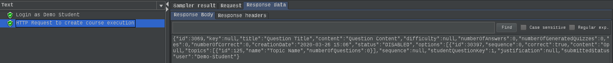
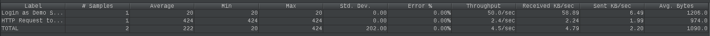
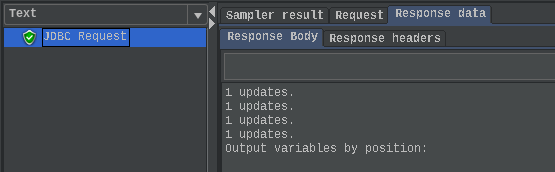

##### F2
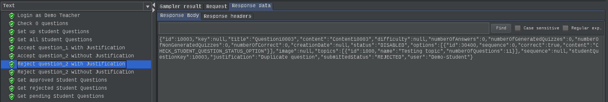
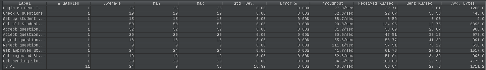
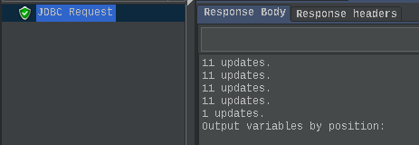

##### F3
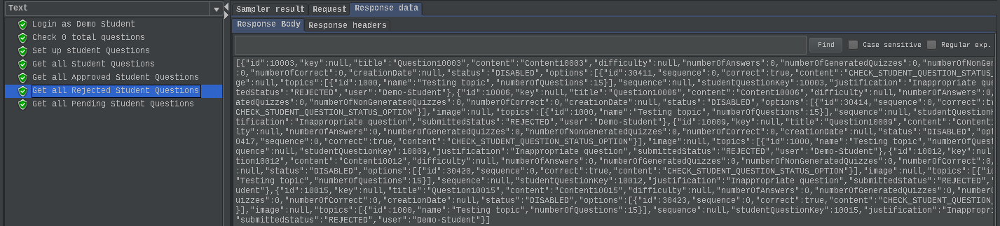
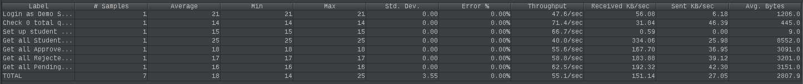
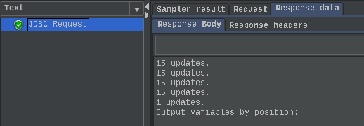

### Load testing

 - [F1-LoadTest](https://github.com/tecnico-softeng/es20al_19-project/blob/develop/backend/jmeter/studentQuestion/WS_F1_CreateStudentQuestion_LoadTest.jmx)
 - [F2-LoadTest](https://github.com/tecnico-softeng/es20al_19-project/blob/develop/backend/jmeter/studentQuestion/WS_F2_EvaluateStudentQuestion_LoadTest.jmx) 
 - [F3-LoadTest](https://github.com/tecnico-softeng/es20al_19-project/blob/develop/backend/jmeter/studentQuestion/WS_F3_CheckStudentQuestionStatus_LoadTest.jmx)

#### Screenshots of Summary Reports and DB cleanup

##### F1
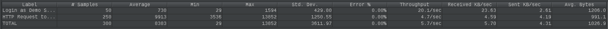
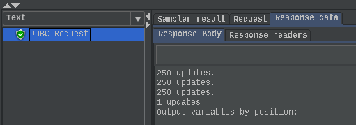

##### F2
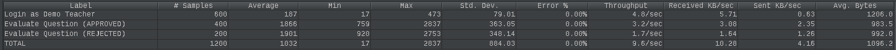
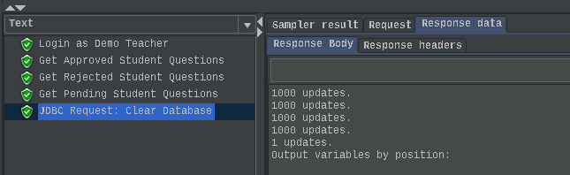

**Note**: The teardown group also checks the number of approved/rejected questions. This has to be done after all the teacher evaluations and before the data removal from the database. Making these tasks in a separate Thread group would conflict with the evaluation (in a normal thread group) or with the teardown (in a teardown thread group);

##### F3
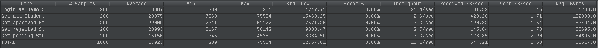
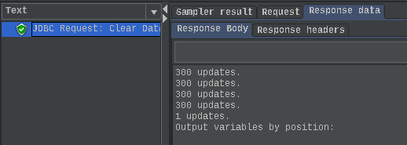

### Service profiling

We used the [Async Profiler](https://www.jetbrains.com/help/idea/async-profiler.html).

#### Screenshots of summary reports

##### F1
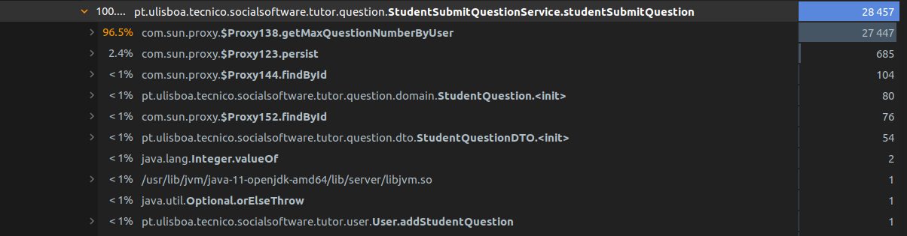
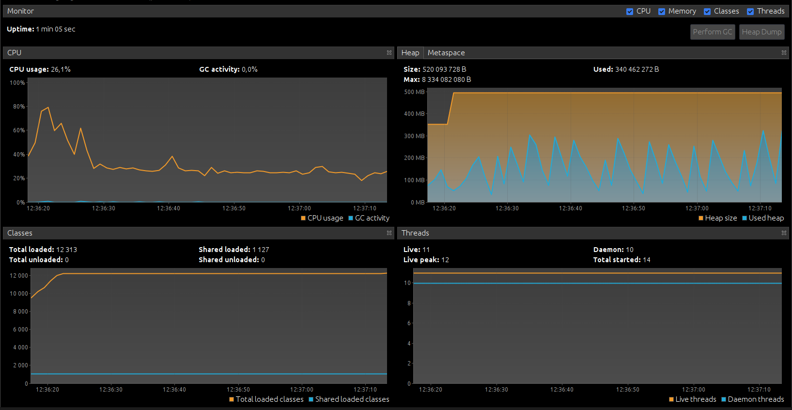
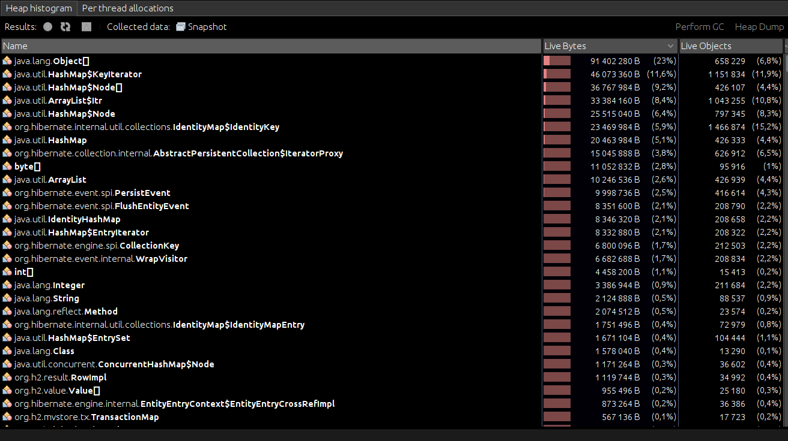

##### F2

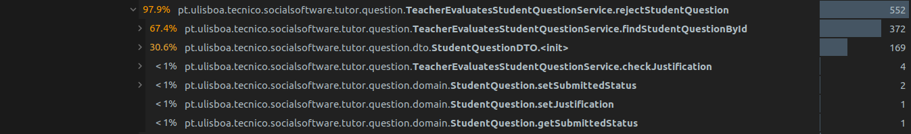
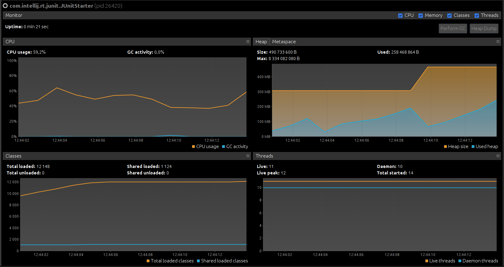
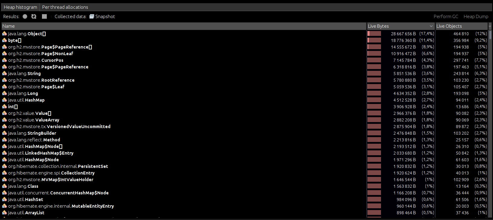

##### F3
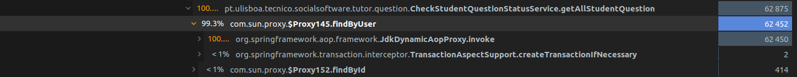
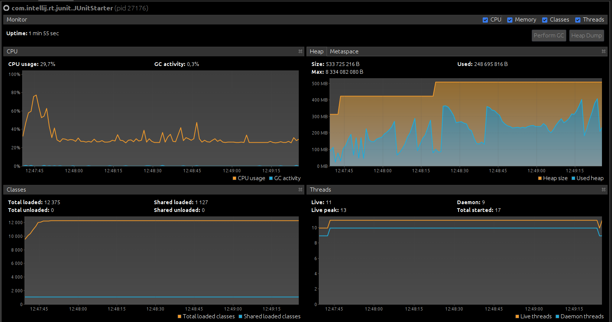
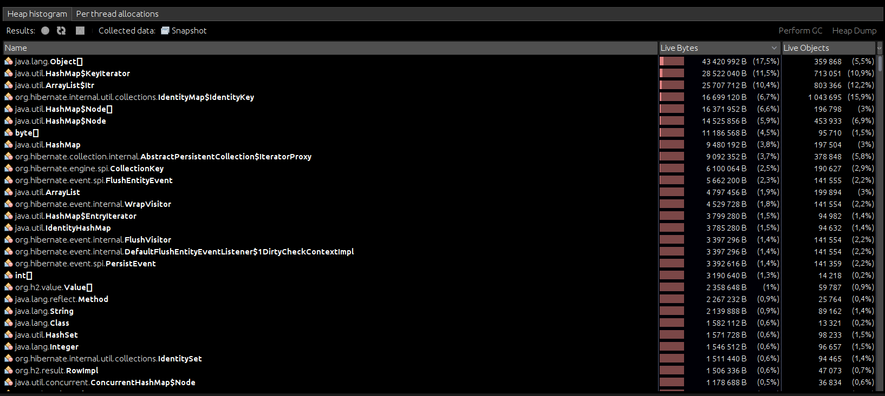

#### Discussion of findings

For F1, it is clear that most of the time (96.5%) is spent querying the database for the max key to use, which is not critical since a question creation doesn't happen a lot and it doesn't take too much time to accomplish individually.
For F2, querying the database takes the majority of the time (67.4%/71.3%), but it is necessary so as to find the correct question to evaluate.
As for F3, the issue is the same with around 99% of time used in the database, which is also necessary to identify the correct user to show his questions.

---

## Feature DDP

### Subgroup
 - André Breda, ist189409, abread
   + Issues assigned: [#85](https://github.com/tecnico-softeng/es20al_19-project/issues/85), [#86](https://github.com/tecnico-softeng/es20al_19-project/issues/86), [#88](https://github.com/tecnico-softeng/es20al_19-project/issues/88)
 - Mariana Oliveira, ist189504, tpoliveira-mariana
   + Issues assigned: [#83](https://github.com/tecnico-softeng/es20al_19-project/issues/83), [#84](https://github.com/tecnico-softeng/es20al_19-project/issues/84), [#87](https://github.com/tecnico-softeng/es20al_19-project/issues/87), [#88](https://github.com/tecnico-softeng/es20al_19-project/issues/88)
 
### Pull requests associated with this feature

The list of pull requests associated with this feature is:

 - [PR #107 - DdP F1](https://github.com/tecnico-softeng/es20al_19-project/pull/107)
 - [PR #10X - DdP F2](https://github.com/tecnico-softeng/es20al_19-project/pull/10X)
 - [PR #002 - DdP F3](https://github.com)

### Web services definition

#### Controllers
 - [ClarificationController](https://github.com/tecnico-softeng/es20al_19-project/blob/35a7cbde3fee1dba04867be1c2a63f82e03fdea8/backend/src/main/java/pt/ulisboa/tecnico/socialsoftware/tutor/clarification/api/ClarificationRequestController.java#L1)

### Feature testing

 - [F1-Test](https://github.com/tecnico-softeng/es20al_19-project/blob/71b0ad975b507fb39bd8b912f40f30594957923a/backend/jmeter/clarification/WSsubmitClarificationRequestTest.jmx#L1)
 - [F2-Test](https://github.com/tecnico-softeng/es20al_19-project/blob/1eb88aad781a92a85101265420e40f1a46fb6edf/backend/jmeter/clarification/WSsubmitClarificationRequestAnswerTest.jmx#L1)
 - [F3-Test](https://github.com/tecnico-softeng/es20al_19-project/blob/71b0ad975b507fb39bd8b912f40f30594957923a/backend/jmeter/clarification/WSgetClarificationRequestAnswerTest.jmx#L1)

#### Screenshots of Results Trees and DB cleanup

##### F1

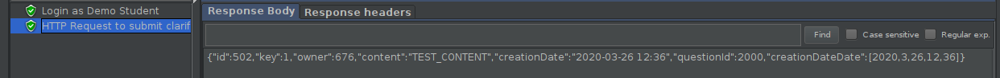
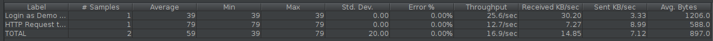
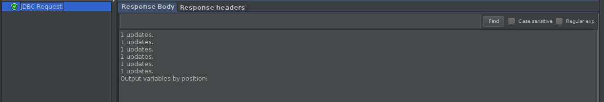

##### F2 - Submit

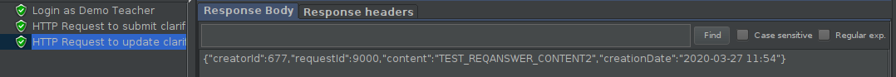
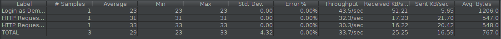
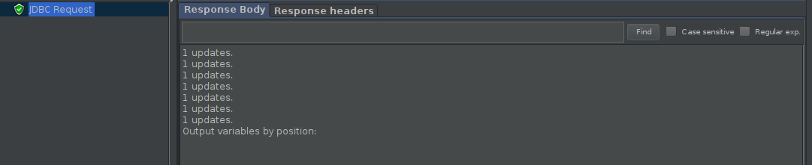

##### F2 - Delete

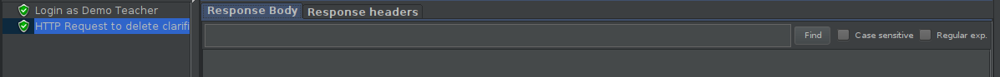
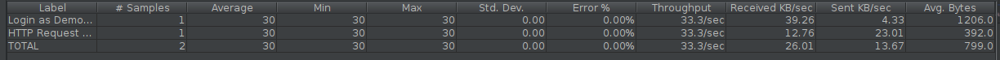
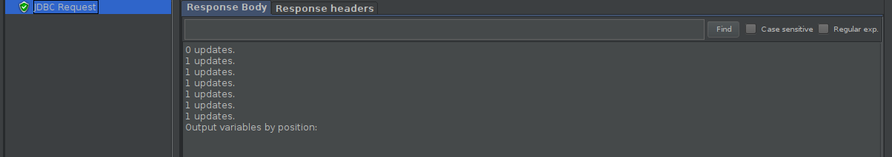

##### F3

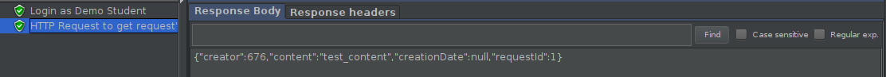
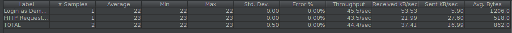
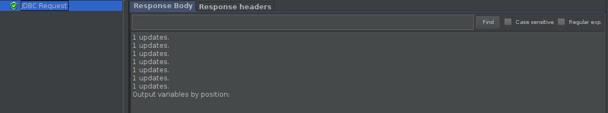

### Load testing

 - [F1-LoadTest](https://github.com/tecnico-softeng/es20al_19-project/blob/e187de01a23c11ecf23fb0f8664651e5e16f5f80/backend/jmeter/clarification/WSsubmitClarificationRequestLoadTest.jmx#L1)
 - [F2-LoadTest](https://github.com)
 - [F3-LoadTest](https://github.com)

#### Screenshots of Summary Reports and DB cleanup

##### F1
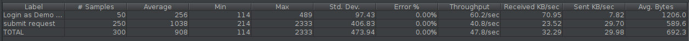
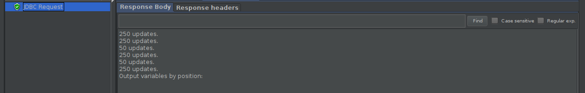

##### F2 - Submit
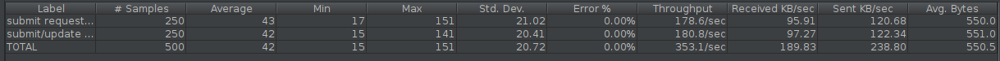
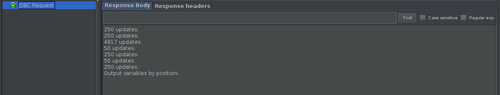

##### F2 - Delete
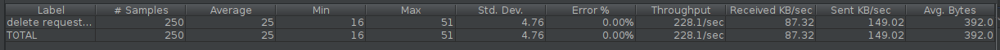
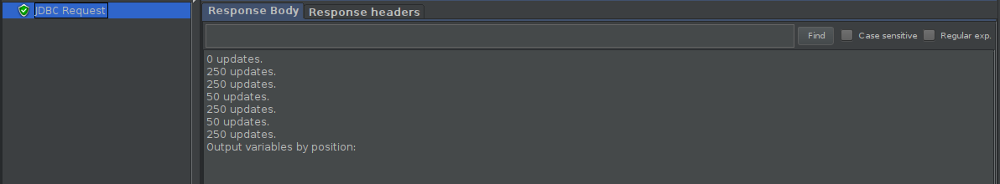

##### F3

### Service profiling

We used the [Async Profiler](https://www.jetbrains.com/help/idea/async-profiler.html).

#### Screenshots of summary reports

##### F1
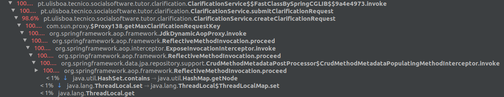
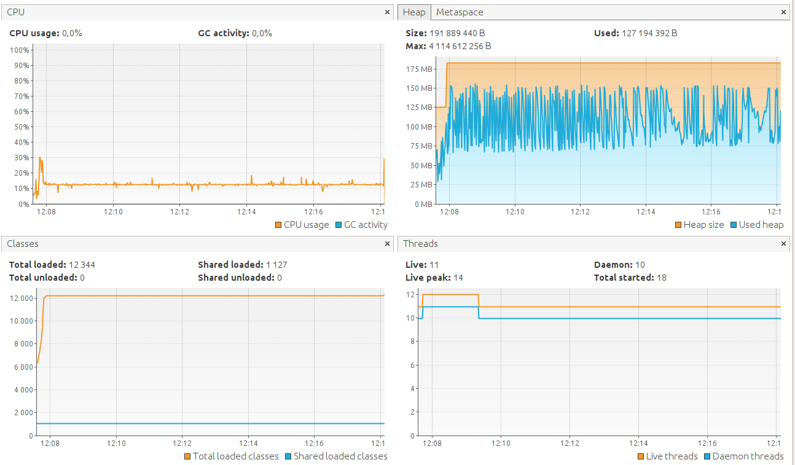
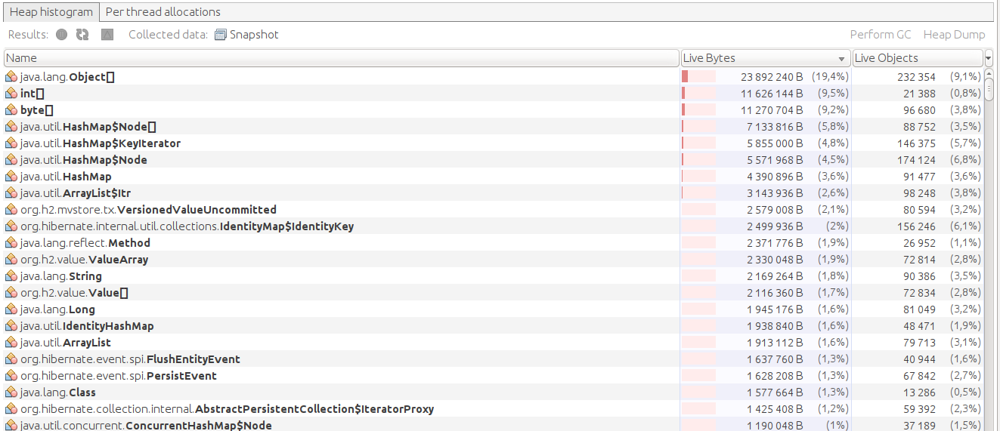

##### F2 - Submit
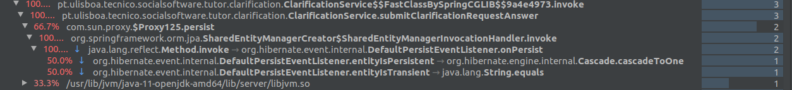
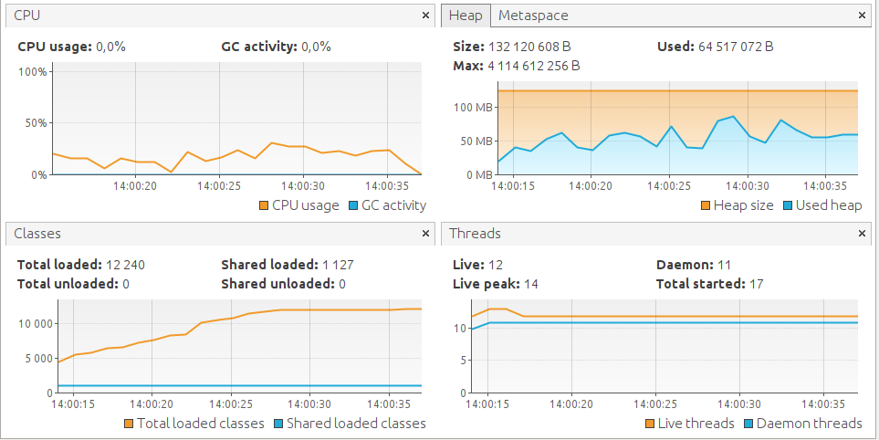
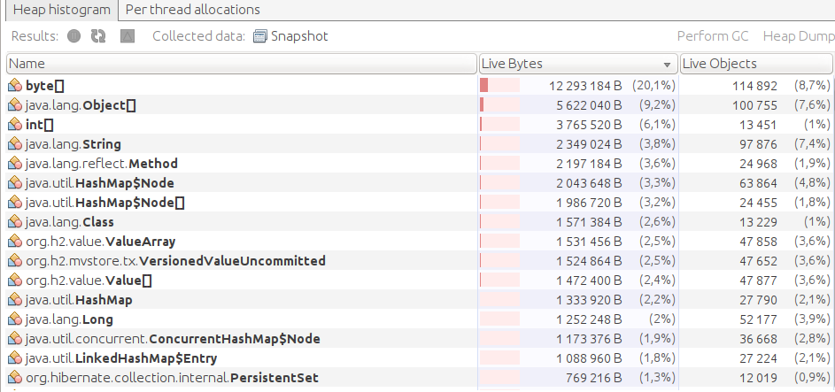

##### F2 - Delete
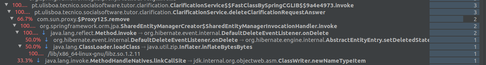
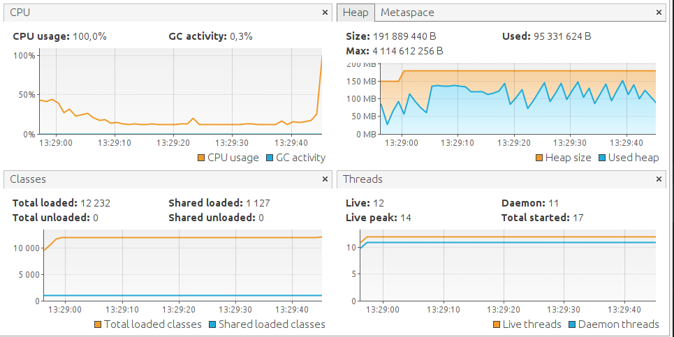

##### F3

#### Discussion of findings

From the `Profiling Percentages`, it is clear that most of F1's execution time is spent on `getMaxClarificationRequestKey`. Moreover, the load test on `WSsubmitClarificationRequest`, revealed that most requests where being denied (for testing purposes we changed it to pass the `key` on the `HTTP Request Body`). Therefore, we decided to refactor the creation of a `ClarificationRequest` by delaying the atribution of a `key` until it is strictly necessary. With this modification, there were no more conflicts and tests that took 13' to run, now take 30s.

---

## Feature TDP

### Subgroup
 - Nome, istID, githubID
   + Issues assigned: [#1](https://github.com), [#3](https://github.com)
 - Nome, istID, githubID
   + Issues assigned: [#2](https://github.com), [#4](https://github.com)
 
### Pull requests associated with this feature

The list of pull requests associated with this feature is:

 - [PR #000](https://github.com)
 - [PR #001](https://github.com)
 - [PR #002](https://github.com)

### Web services definition

#### Controllers
 - [Controller0](https://github.com)
 - [Controller1](https://github.com)

### Feature testing

Each subgroup member defined one reading test and one writing test. The direct links to these are:

 - [ReadingTestJMeter](https://github.com)
 - [WritingTestJMeter](https://github.com)

#### Screenshots of Results Trees and DB cleanup

### Load testing

Each subgroup member defined one reading test and one writing test. The direct links to these are:

 - [ReadingTestJMeter](https://github.com)
 - [WritingTestJMeter](https://github.com)

#### Screenshots of Summary Reports and DB cleanup

### Service profiling

We used the [Async Profiler](https://www.jetbrains.com/help/idea/async-profiler.html).

#### Screenshots of summary reports

#### Discussion of findings

**TODO**: include here a short description of findings (max. 3 sentences). If
you found opportunities for optimization, you can use more than 3 sentences to
describe what you found and how you optimized your code.

