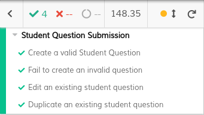
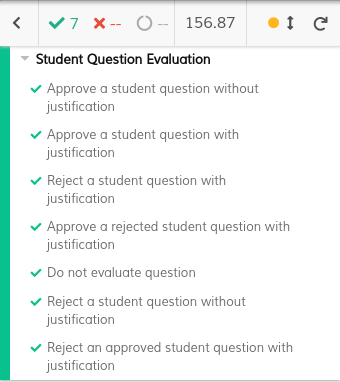
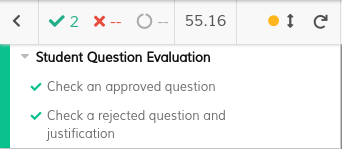
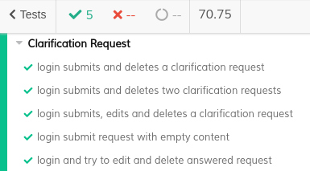
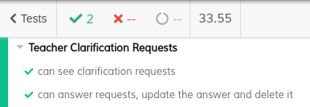
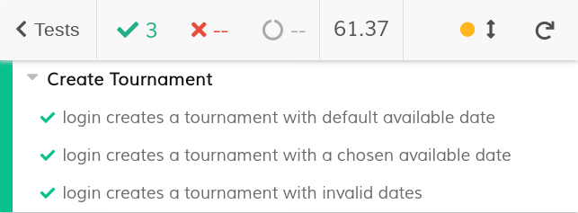
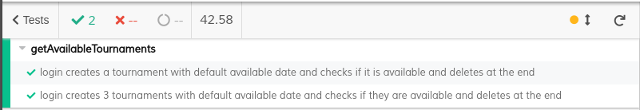

# ES20 P3 submission, Group 19

## Feature PPA

### Subgroup

 - Afonso Gonçalves, ist189399, afonsocrg
   + Issues assigned: [#133](https://github.com/tecnico-softeng/es20al_19-project/issues/133), [#134](https://github.com/tecnico-softeng/es20al_19-project/issues/134), [#154](https://github.com/tecnico-softeng/es20al_19-project/issues/154), [#155](https://github.com/tecnico-softeng/es20al_19-project/issues/155)
 - Daniel Seara, ist189427, Beu-Wolf
   + Issues assigned: [#131](https://github.com/tecnico-softeng/es20al_19-project/issues/131), [#132](https://github.com/tecnico-softeng/es20al_19-project/issues/132), [#135](https://github.com/tecnico-softeng/es20al_19-project/issues/135), [#136](https://github.com/tecnico-softeng/es20al_19-project/issues/136), [#156](https://github.com/tecnico-softeng/es20al_19-project/issues/156)
 
### Pull requests associated with this feature

The list of pull requests associated with this feature is:

 - [PR #159](https://github.com/tecnico-softeng/es20al_19-project/pull/159): F1 Frontend
 - [PR #166](https://github.com/tecnico-softeng/es20al_19-project/pull/166): F3 Frontend
 - [PR #170](https://github.com/tecnico-softeng/es20al_19-project/pull/170): F2 Frontend
 - [PR #173](https://github.com/tecnico-softeng/es20al_19-project/pull/173): F1 E2E
 - [PR #185](https://github.com/tecnico-softeng/es20al_19-project/pull/185): F2 E2E + F1 E2E refactoring
 - [PR #189](https://github.com/tecnico-softeng/es20al_19-project/pull/189): F3 E2E

### Frontend

#### New/Updated Views

 - [TopBar](https://github.com/tecnico-softeng/es20al_19-project/blob/P3-report/frontend/src/components/TopBar.vue)
 - [EditStudentQuestionDialog](https://github.com/tecnico-softeng/es20al_19-project/blob/develop/frontend/src/views/student/EditStudentQuestionDialog.vue)
 - [EvaluateStudentQuestionDialog](https://github.com/tecnico-softeng/es20al_19-project/blob/develop/frontend/src/views/teacher/questions/EvaluateStudentQuestionDialog.vue)
 - [ShowJustification](https://github.com/tecnico-softeng/es20al_19-project/blob/develop/frontend/src/views/student/ShowJustification.vue)
 - [ShowStudentQuestion](https://github.com/tecnico-softeng/es20al_19-project/blob/develop/frontend/src/views/student/ShowStudentQuestion.vue)
 - [ShowStudentQuestionDialog](https://github.com/tecnico-softeng/es20al_19-project/blob/develop/frontend/src/views/student/ShowStudentQuestionDialog.vue)
 - [ShowStudentQuestionJustification](https://github.com/tecnico-softeng/es20al_19-project/blob/develop/frontend/src/views/student/ShowStudentQuestionJustification.vue)
 - [StudentQuestionView (student view)](https://github.com/tecnico-softeng/es20al_19-project/blob/develop/frontend/src/views/student/StudentQuestionView.vue)
 - [StudentQuestionView (teacher view)](https://github.com/tecnico-softeng/es20al_19-project/blob/develop/frontend/src/views/teacher/questions/StudentQuestionView.vue)

#### New/Updated Models

 - [StudentQuestion](https://github.com/tecnico-softeng/es20al_19-project/blob/develop/frontend/src/models/management/StudentQuestion.ts)

### Additional services implemented

 - [UpdateStudentQuestion](https://github.com/tecnico-softeng/es20al_19-project/blob/develop/backend/src/main/java/pt/ulisboa/tecnico/socialsoftware/tutor/question/StudentSubmitQuestionService.java)
    + [StudentQuestionController](https://github.com/tecnico-softeng/es20al_19-project/blob/develop/backend/src/main/java/pt/ulisboa/tecnico/socialsoftware/tutor/question/api/StudentQuestionController.java)
    + [UpdateStudentQuestionTest](https://github.com/tecnico-softeng/es20al_19-project/blob/develop/backend/src/test/groovy/pt/ulisboa/tecnico/socialsoftware/tutor/studentquestion/service/UpdateStudentQuestionTest.groovy)
    + [JMeter-Test](https://github.com/tecnico-softeng/es20al_19-project/blob/develop/backend/jmeter/studentQuestion/WS_UpdateStudentQuestion.jmx)

 - [RemoveStudentQuestion](https://github.com/tecnico-softeng/es20al_19-project/blob/develop/backend/src/main/java/pt/ulisboa/tecnico/socialsoftware/tutor/question/RemoveStudentQuestionService.java)
    + [StudentQuestionController](https://github.com/tecnico-softeng/es20al_19-project/blob/develop/backend/src/main/java/pt/ulisboa/tecnico/socialsoftware/tutor/question/api/StudentQuestionController.java)
    + [RemoveStudentQuestionTest](https://github.com/tecnico-softeng/es20al_19-project/blob/develop/backend/src/test/groovy/pt/ulisboa/tecnico/socialsoftware/tutor/studentquestion/service/RemoveStudentQuestionTest.groovy)
    + [JMeter-Test](https://github.com/tecnico-softeng/es20al_19-project/blob/develop/backend/jmeter/studentQuestion/WS_RemoveStudentQuestion.jmx)

### End-to-end tests

#### Created tests

**F1:**
 - [Create a valid student question](https://github.com/tecnico-softeng/es20al_19-project/blob/develop/frontend/tests/e2e/specs/student/studentSubmitStudentQuestion.js#L41)
 - [Fail to create a valid student questions](https://github.com/tecnico-softeng/es20al_19-project/blob/develop/frontend/tests/e2e/specs/student/studentSubmitStudentQuestion.js#L80)
 - [Edit an existing student question](https://github.com/tecnico-softeng/es20al_19-project/blob/develop/frontend/tests/e2e/specs/student/studentSubmitStudentQuestion.js#L124)
 - [Duplicate an existing student question](https://github.com/tecnico-softeng/es20al_19-project/blob/develop/frontend/tests/e2e/specs/student/studentSubmitStudentQuestion.js#L173)

**F2:**
 - [Approve a student question without justification](https://github.com/tecnico-softeng/es20al_19-project/blob/develop/frontend/tests/e2e/specs/teacher/evaluateStudentQuestion.js#L38)
 - [Approve a student question with justification](https://github.com/tecnico-softeng/es20al_19-project/blob/develop/frontend/tests/e2e/specs/teacher/evaluateStudentQuestion.js#L60)
 - [Reject a student question with justification](https://github.com/tecnico-softeng/es20al_19-project/blob/develop/frontend/tests/e2e/specs/teacher/evaluateStudentQuestion.js#L82)
 - [Approve a rejected student question with justification](https://github.com/tecnico-softeng/es20al_19-project/blob/develop/frontend/tests/e2e/specs/teacher/evaluateStudentQuestion.js#L104)
 - [Do not evaluate question](https://github.com/tecnico-softeng/es20al_19-project/blob/develop/frontend/tests/e2e/specs/teacher/evaluateStudentQuestion.js#L130)
 - [Reject a student question without justification](https://github.com/tecnico-softeng/es20al_19-project/blob/develop/frontend/tests/e2e/specs/teacher/evaluateStudentQuestion.js#L150)
 - [Reject an approved student question with justification](https://github.com/tecnico-softeng/es20al_19-project/blob/develop/frontend/tests/e2e/specs/teacher/evaluateStudentQuestion.js#L170)

**F3:**
 - [Check an approved question status](https://github.com/tecnico-softeng/es20al_19-project/blob/PpA/frontend/tests/e2e/specs/student/studentChecksStudentQuestion.js#L56)
 - [Check a rejected question status and justification](https://github.com/tecnico-softeng/es20al_19-project/blob/PpA/frontend/tests/e2e/specs/student/studentChecksStudentQuestion.js#L71)

#### Rationale
In the end-to-end tests, we tried to cover the most common use cases of this feature: all the correct procedures (from creating Student Questions to evaluating them), but also the ones that are not permitted, resulting from a user who is unfamiliar with the interface or with the Quiz Tutor itself. This kind of interactions shall not be accepted by the server and shall display an understandable error message to the user

#### Commands defined
 - [demoStudentLogin](https://github.com/tecnico-softeng/es20al_19-project/blob/develop/frontend/tests/e2e/support/commands.js#L39)
 - [demoTeacherLogin](https://github.com/tecnico-softeng/es20al_19-project/blob/develop/frontend/tests/e2e/support/commands.js#L34)
 - [createStudentQuestion](https://github.com/tecnico-softeng/es20al_19-project/blob/develop/frontend/tests/e2e/support/commands.js#L210)
 - [editStudentQuestion](https://github.com/tecnico-softeng/es20al_19-project/blob/develop/frontend/tests/e2e/support/commands.js#L335)
 - [evaluateStudentQuestion](https://github.com/tecnico-softeng/es20al_19-project/blob/develop/frontend/tests/e2e/support/commands.js#L249)
 - [assertStudentQuestionEvaluation](https://github.com/tecnico-softeng/es20al_19-project/blob/develop/frontend/tests/e2e/support/commands.js#L279)
 - [studentAssertEvaluation](https://github.com/tecnico-softeng/es20al_19-project/blob/develop/frontend/tests/e2e/support/commands.js#L298)
 - [errorMessageClose](https://github.com/tecnico-softeng/es20al_19-project/blob/develop/frontend/tests/e2e/support/commands.js#L327) :(The already existing similar function didn't meet our requirements and we didn't want to remove it)

#### Screenshot of test results overview

 - Student Question Submission Test results:

 - Student Question Evaluation Test results:

 - Student Question Verification Test results:
 

---

## Feature DDP

### Subgroup

 - André Breda, ist189409, abread
   + Issues assigned: [#147](https://github.com/tecnico-softeng/es20al_19-project/issues/147), [#148](https://github.com/tecnico-softeng/es20al_19-project/issues/148), [#149](https://github.com/tecnico-softeng/es20al_19-project/issues/149), [#150](https://github.com/tecnico-softeng/es20al_19-project/issues/150)
 - Mariana Oliveira, ist189504, tpoliveira-mariana
   + Issues assigned: [#143](https://github.com/tecnico-softeng/es20al_19-project/issues/143), [#144](https://github.com/tecnico-softeng/es20al_19-project/issues/144), [#145](https://github.com/tecnico-softeng/es20al_19-project/issues/145), [#146](https://github.com/tecnico-softeng/es20al_19-project/issues/146), [#163](https://github.com/tecnico-softeng/es20al_19-project/issues/163), [#165](https://github.com/tecnico-softeng/es20al_19-project/issues/165)
 
### Pull requests associated with this feature

The list of pull requests associated with this feature is:

 - [PR #171](https://github.com/tecnico-softeng/es20al_19-project/pull/171) : F1
 - [PR #179](https://github.com/tecnico-softeng/es20al_19-project/pull/179) : F2 
 - [PR #187](https://github.com/tecnico-softeng/es20al_19-project/pull/187) : F3

### Frontend

#### New/Updated Views
 - [Top Bar](https://github.com/tecnico-softeng/es20al_19-project/blob/d179a553b4de2e822f88aedfeab2ff33b50e7e39/frontend/src/components/TopBar.vue#L1)

 - [ResultsView](https://github.com/tecnico-softeng/es20al_19-project/blob/11e01f5704be16aa6dbbf1e7edc3848addd5fc17/frontend/src/views/student/quiz/ResultsView.vue#L1)
 - [DiscussionComponent](https://github.com/tecnico-softeng/es20al_19-project/blob/11e01f5704be16aa6dbbf1e7edc3848addd5fc17/frontend/src/views/student/quiz/DiscussionComponent.vue#L1)
 - [ClarificationsView](https://github.com/tecnico-softeng/es20al_19-project/blob/11e01f5704be16aa6dbbf1e7edc3848addd5fc17/frontend/src/views/student/ClarificationsView.vue#L1)
 - [ClarificationRequestsView](https://github.com/tecnico-softeng/es20al_19-project/blob/11e01f5704be16aa6dbbf1e7edc3848addd5fc17/frontend/src/views/teacher/clarifications/ClarificationRequestsView.vue#L1)

#### New/Updated Models

 - [StatementManager](https://github.com/tecnico-softeng/es20al_19-project/blob/11e01f5704be16aa6dbbf1e7edc3848addd5fc17/frontend/src/models/statement/StatementManager.ts#L1)
 - [StatementQuiz](https://github.com/tecnico-softeng/es20al_19-project/blob/11e01f5704be16aa6dbbf1e7edc3848addd5fc17/frontend/src/models/statement/StatementQuiz.ts#L1)
 - [StatementQuestion](https://github.com/tecnico-softeng/es20al_19-project/blob/11e01f5704be16aa6dbbf1e7edc3848addd5fc17/frontend/src/models/statement/StatementQuestion.ts#L1)
 - [ClarificationRequest](https://github.com/tecnico-softeng/es20al_19-project/blob/11e01f5704be16aa6dbbf1e7edc3848addd5fc17/frontend/src/models/clarification/ClarificationRequest.ts#L1)
 - [ClarificationRequestAnswer](https://github.com/tecnico-softeng/es20al_19-project/blob/11e01f5704be16aa6dbbf1e7edc3848addd5fc17/frontend/src/models/clarification/ClarificationRequestAnswer.ts#L1)

### Additional services implemented

 - [getStudentClarificationRequests](https://github.com/tecnico-softeng/es20al_19-project/blob/6b14dc4ffca5b3357e3d57c6760b0414a25d28c3/backend/src/main/java/pt/ulisboa/tecnico/socialsoftware/tutor/clarification/ClarificationService.java#L172)
    + [ClarificationController](https://github.com/tecnico-softeng/es20al_19-project/blob/6b14dc4ffca5b3357e3d57c6760b0414a25d28c3/backend/src/main/java/pt/ulisboa/tecnico/socialsoftware/tutor/clarification/ClarificationController.java#L58)
    + [GetStudentClarificationRequestsServiceSpockTest](https://github.com/tecnico-softeng/es20al_19-project/blob/6b14dc4ffca5b3357e3d57c6760b0414a25d28c3/backend/src/test/groovy/pt/ulisboa/tecnico/socialsoftware/tutor/clarification/service/GetStudentClarificationRequestsServiceSpockTest.groovy#L1)
    + [WSgetStudentClarificationRequestsTest](https://github.com/tecnico-softeng/es20al_19-project/blob/6b14dc4ffca5b3357e3d57c6760b0414a25d28c3/backend/jmeter/clarification/WSgetStudentClarificationRequests.jmx#L1)

 - [updateClarificationRequest](https://github.com/tecnico-softeng/es20al_19-project/blob/6b14dc4ffca5b3357e3d57c6760b0414a25d28c3/backend/src/main/java/pt/ulisboa/tecnico/socialsoftware/tutor/clarification/ClarificationService.java#L128)
    + [ClarificationController](https://github.com/tecnico-softeng/es20al_19-project/blob/6b14dc4ffca5b3357e3d57c6760b0414a25d28c3/backend/src/main/java/pt/ulisboa/tecnico/socialsoftware/tutor/clarification/ClarificationController.java#L46)
    + [UpdateClarificationRequestServiceSpockTest](https://github.com/tecnico-softeng/es20al_19-project/blob/6b14dc4ffca5b3357e3d57c6760b0414a25d28c3/backend/src/test/groovy/pt/ulisboa/tecnico/socialsoftware/tutor/clarification/service/UpdateClarificationRequestServiceSpockTest.groovy#L1)
    + [WSupdateClarificationRequestTest](https://github.com/tecnico-softeng/es20al_19-project/blob/6b14dc4ffca5b3357e3d57c6760b0414a25d28c3/backend/jmeter/clarification/WSupdateClarificationRequestTest.jmx#L1)

 - [deleteClarificationRequest](https://github.com/tecnico-softeng/es20al_19-project/blob/6b14dc4ffca5b3357e3d57c6760b0414a25d28c3/backend/src/main/java/pt/ulisboa/tecnico/socialsoftware/tutor/clarification/ClarificationService.java#L110)
    + [ClarificationController](https://github.com/tecnico-softeng/es20al_19-project/blob/6b14dc4ffca5b3357e3d57c6760b0414a25d28c3/backend/src/main/java/pt/ulisboa/tecnico/socialsoftware/tutor/clarification/ClarificationController.java#L34)
    + [DeleteClarificationRequestServiceSpockTest](https://github.com/tecnico-softeng/es20al_19-project/blob/6b14dc4ffca5b3357e3d57c6760b0414a25d28c3/backend/src/test/groovy/pt/ulisboa/tecnico/socialsoftware/tutor/clarification/service/DeleteClarificationRequestServiceSpockTest.groovy#L1)
    + [WSdeleteClarificationRequestTest](https://github.com/tecnico-softeng/es20al_19-project/blob/6b14dc4ffca5b3357e3d57c6760b0414a25d28c3/backend/jmeter/clarification/WSdeleteClarificationRequestTest.jmx#L1)

 - [getTeacherClarificationRequests](https://github.com/tecnico-softeng/es20al_19-project/blob/d179a553b4de2e822f88aedfeab2ff33b50e7e39/backend/src/main/java/pt/ulisboa/tecnico/socialsoftware/tutor/clarification/ClarificationService.java#L207)
    + [ClarificationController](https://github.com/tecnico-softeng/es20al_19-project/blob/d179a553b4de2e822f88aedfeab2ff33b50e7e39/backend/src/main/java/pt/ulisboa/tecnico/socialsoftware/tutor/clarification/ClarificationController.java#L72)
    + [GetTeacherClarificationRequestsSpockTest](https://github.com/tecnico-softeng/es20al_19-project/blob/d179a553b4de2e822f88aedfeab2ff33b50e7e39/backend/src/test/groovy/pt/ulisboa/tecnico/socialsoftware/tutor/clarification/service/GetTeacherClarificationRequestsSpockTest.groovy#L1)
    + [WSgetClarificationRequestsTest](https://github.com/tecnico-softeng/es20al_19-project/blob/d179a553b4de2e822f88aedfeab2ff33b50e7e39/backend/jmeter/clarification/WSgetClarificationRequestsTest.jmx#L1)

### End-to-end tests

#### Created tests
##### Student
 - [login submits and deletes a clarification request](https://github.com/tecnico-softeng/es20al_19-project/blob/6b14dc4ffca5b3357e3d57c6760b0414a25d28c3/frontend/tests/e2e/specs/student/manageClarificationRequests.js#L15)
 - [login submits and deletes two clarification requests](https://github.com/tecnico-softeng/es20al_19-project/blob/6b14dc4ffca5b3357e3d57c6760b0414a25d28c3/frontend/tests/e2e/specs/student/manageClarificationRequests.js#L22)
 - [login submit request with empty content](https://github.com/tecnico-softeng/es20al_19-project/blob/6b14dc4ffca5b3357e3d57c6760b0414a25d28c3/frontend/tests/e2e/specs/student/manageClarificationRequests.js#L36)
 - [login and try to edit and delete answered request](https://github.com/tecnico-softeng/es20al_19-project/blob/6b14dc4ffca5b3357e3d57c6760b0414a25d28c3/frontend/tests/e2e/specs/student/manageClarificationRequests.js#L44)

 ##### Teacher
 - [can see clarification requests](https://github.com/tecnico-softeng/es20al_19-project/blob/6b14dc4ffca5b3357e3d57c6760b0414a25d28c3/frontend/tests/e2e/specs/teacher/manageClarificationRequests.js#L29)
 - [can answer requests, update the answer and delete it](https://github.com/tecnico-softeng/es20al_19-project/blob/6b14dc4ffca5b3357e3d57c6760b0414a25d28c3/frontend/tests/e2e/specs/teacher/manageClarificationRequests.js#L36)

#### Rationale
In the end-to-end tests, we tried to cover the most common use cases of this feature: all the correct procedures (from a Clarification Request submission, to it's answer, and respective edition and deletion), but also the ones that are not permitted, resulting from lack of familiarity with the interface or Quiz Tutor itself. This kind of interactions result in the display of an understandable error message to the user.

#### Commands defined
 - [demoStudentLogin](https://github.com/tecnico-softeng/es20al_19-project/blob/d179a553b4de2e822f88aedfeab2ff33b50e7e39/frontend/tests/e2e/support/commands.js#L39)
 - [demoTeacherLogin](https://github.com/tecnico-softeng/es20al_19-project/blob/d179a553b4de2e822f88aedfeab2ff33b50e7e39/frontend/tests/e2e/support/commands.js#L34)
 - [generateAndAnswerQuiz](https://github.com/tecnico-softeng/es20al_19-project/blob/d179a553b4de2e822f88aedfeab2ff33b50e7e39/frontend/tests/e2e/support/commands.js#L101)
 - [submitClarificationRequest](https://github.com/tecnico-softeng/es20al_19-project/blob/d179a553b4de2e822f88aedfeab2ff33b50e7e39/frontend/tests/e2e/support/commands.js#L123)
 - [goToMyClarifications](https://github.com/tecnico-softeng/es20al_19-project/blob/d179a553b4de2e822f88aedfeab2ff33b50e7e39/frontend/tests/e2e/support/commands.js#L138)
 - [deleteAllRequests](https://github.com/tecnico-softeng/es20al_19-project/blob/d179a553b4de2e822f88aedfeab2ff33b50e7e39/frontend/tests/e2e/support/commands.js#L143)
 - [editClarificationRequest](https://github.com/tecnico-softeng/es20al_19-project/blob/d179a553b4de2e822f88aedfeab2ff33b50e7e39/frontend/tests/e2e/support/commands.js#L160)
 - [answerClarificationRequest](https://github.com/tecnico-softeng/es20al_19-project/blob/d179a553b4de2e822f88aedfeab2ff33b50e7e39/frontend/tests/e2e/support/commands.js#L184)
 - [deleteClarificationRequestAnswer](https://github.com/tecnico-softeng/es20al_19-project/blob/d179a553b4de2e822f88aedfeab2ff33b50e7e39/frontend/tests/e2e/support/commands.js#L197)

#### Screenshot of test results overview
 - Student's management of Clarification Requests:

 - Teacher's management of Clarification Requests:

---

## Feature TDP

### Subgroup
 - Lourenço Ramos Duarte, ist197023, LourencoPonces
   + Issues assigned: [#139](https://github.com/tecnico-softeng/es20al_19-project/issues/139), [#140](https://github.com/tecnico-softeng/es20al_19-project/issues/140), [#141](https://github.com/tecnico-softeng/es20al_19-project/issues/141), [#142](https://github.com/tecnico-softeng/es20al_19-project/issues/142), [#192](https://github.com/tecnico-softeng/es20al_19-project/issues/192), [#193](https://github.com/tecnico-softeng/es20al_19-project/issues/193) 
 - Marcelo Santos, ist189496, tosmarcel
   + Issues assigned: [#137](https://github.com/tecnico-softeng/es20al_19-project/issues/137), [#138](https://github.com/tecnico-softeng/es20al_19-project/issues/138), [#180](https://github.com/tecnico-softeng/es20al_19-project/issues/180), [#195](https://github.com/tecnico-softeng/es20al_19-project/issues/195)
 
### Pull requests associated with this feature

The list of pull requests associated with this feature is:

 - [PR #177](https://github.com/tecnico-softeng/es20al_19-project/pull/177)
 - [PR #182](https://github.com/tecnico-softeng/es20al_19-project/pull/182)
 - [PR #190](https://github.com/tecnico-softeng/es20al_19-project/pull/190)
 - [PR #197](https://github.com/tecnico-softeng/es20al_19-project/pull/197)
 - [PR #200](https://github.com/tecnico-softeng/es20al_19-project/pull/200)

### Frontend

#### New/Updated Views

 - [AvailableTournamentsView](https://github.com/tecnico-softeng/es20al_19-project/blob/develop/frontend/src/views/student/tournament/AvailableTournamentsView.vue)
 - [EditTournamentDialog](https://github.com/tecnico-softeng/es20al_19-project/blob/develop/frontend/src/views/student/tournament/EditTournamentDialog.vue)
 - [Top Bar](https://github.com/tecnico-softeng/es20al_19-project/blob/develop/frontend/src/components/TopBar.vue)

#### New/Updated Models

 - [Tournament](https://github.com/tecnico-softeng/es20al_19-project/blob/develop/frontend/src/models/management/Tournament.ts)
 - [User](https://github.com/tecnico-softeng/es20al_19-project/blob/develop/frontend/src/models/user/User.ts)

### Additional services implemented

 - [deleteTournament](https://github.com)
    + [TournamentController](https://github.com/tecnico-softeng/es20al_19-project/blob/develop/backend/src/main/java/pt/ulisboa/tecnico/socialsoftware/tutor/tournament/api/TournamentController.java#L78)
    + [Spock tests](https://github.com/tecnico-softeng/es20al_19-project/blob/develop/backend/src/test/groovy/pt/ulisboa/tecnico/socialsoftware/tutor/tournament/service/DeleteTournamentTest.groovy)
    + [Feature test (JMeter)](https://github.com/tecnico-softeng/es20al_19-project/blob/develop/backend/jmeter/tournament/WSDeleteTournamentTest.jmx)

### End-to-end tests

#### Created tests

**F1:**
 - [Login creates a tournament with default available date](https://github.com/tecnico-softeng/es20al_19-project/blob/c6f2a2ae7189fd9f46c39ac1054e1433c4092c61/frontend/tests/e2e/specs/student/createTournament.js#L10)
 - [Login creates a tournament with a chosen available date](https://github.com/tecnico-softeng/es20al_19-project/blob/c6f2a2ae7189fd9f46c39ac1054e1433c4092c61/frontend/tests/e2e/specs/student/createTournament.js#L22)
 - [Login creates a tournament with invalid dates](https://github.com/tecnico-softeng/es20al_19-project/blob/c6f2a2ae7189fd9f46c39ac1054e1433c4092c61/frontend/tests/e2e/specs/student/createTournament.js#L34)

**F2:**
 - [Login creates a tournament with default available date and checks if it is available and deletes at the end](https://github.com/tecnico-softeng/es20al_19-project/blob/a344d91ce913ac39687cff0ce89e9e35a7e1b8fd/frontend/tests/e2e/specs/student/getAvailableTournaments.js#L10)
 - [Login creates 3 tournaments with default available date and checks if they are available and deletes at the end](https://github.com/tecnico-softeng/es20al_19-project/blob/a344d91ce913ac39687cff0ce89e9e35a7e1b8fd/frontend/tests/e2e/specs/student/getAvailableTournaments.js#L25)

**F3:**
 - [Login creates a tournament, checks sign-up status and deletes](https://github.com/tecnico-softeng/es20al_19-project/blob/a344d91ce913ac39687cff0ce89e9e35a7e1b8fd/frontend/tests/e2e/specs/student/signUpInTournament.js#L10)

#### Rationale
We did end to end tests to cover only the basic parts of the functionalities that were implemented. Most of the tests were done in createTournament where the tournaments were created with different attributes. In getAvailableTournaments we tested if the created tournaments were being listed in the right way. At last, in signUpInTournaments it was only made one test where we checked if the creator of the tournament was signed-up. We didn't test the action of signing-up because for that it was required creating a tournament by one student and then signing-up by other, and we were using, always, for all tests, the same user because that was a requirement for the other tests of the other functionalities.

#### Commands defined

 - [createTournament](https://github.com/tecnico-softeng/es20al_19-project/blob/c6f2a2ae7189fd9f46c39ac1054e1433c4092c61/frontend/tests/e2e/support/commands.js#L449)
 - [deleteTournament](https://github.com/tecnico-softeng/es20al_19-project/blob/c6f2a2ae7189fd9f46c39ac1054e1433c4092c61/frontend/tests/e2e/support/commands.js#L533)

#### Screenshot of test results overview

 - Student Creates Tournament:
 

 - Student Gets the Available Tournaments:
 

 - Stundent is signed-up in Tournament:
 

