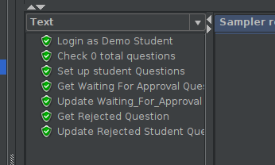
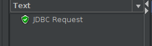
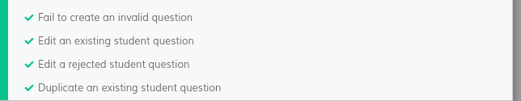
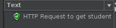
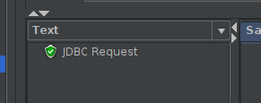
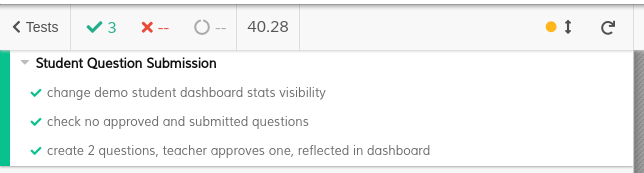
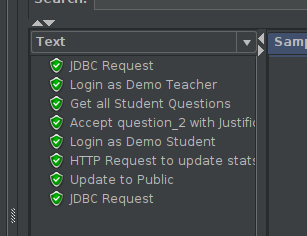

# ES20 P4 submission, Group 19

## Feature PPA

### Subgroup

 - Afonso Gonçalves, ist189399, afonsocrg
   + Issues assigned: [#201](https://github.com/tecnico-softeng/es20al_19-project/issues/201), [#203](https://github.com/tecnico-softeng/es20al_19-project/issues/203), [#205](https://github.com/tecnico-softeng/es20al_19-project/issues/205), [#206](https://github.com/tecnico-softeng/es20al_19-project/issues/206), [#208](https://github.com/tecnico-softeng/es20al_19-project/issues/208), [#210](https://github.com/tecnico-softeng/es20al_19-project/issues/210), [#256](https://github.com/tecnico-softeng/es20al_19-project/issues/256), [#267](https://github.com/tecnico-softeng/es20al_19-project/issues/267), [#269](https://github.com/tecnico-softeng/es20al_19-project/issues/269), [#270](https://github.com/tecnico-softeng/es20al_19-project/issues/270), [#288](https://github.com/tecnico-softeng/es20al_19-project/issues/288), [#296](https://github.com/tecnico-softeng/es20al_19-project/issues/296), [#320](https://github.com/tecnico-softeng/es20al_19-project/issues/320), [#321](https://github.com/tecnico-softeng/es20al_19-project/issues/321), [#322](https://github.com/tecnico-softeng/es20al_19-project/issues/322), [#323](https://github.com/tecnico-softeng/es20al_19-project/issues/323), [#324](https://github.com/tecnico-softeng/es20al_19-project/issues/324), [#325](https://github.com/tecnico-softeng/es20al_19-project/issues/325)
   + Tasks: F4:Service, F4:Spock Tests, F4:Web Service, F4:JMeter Tests, F4: Frontent, F4: Cypress use case Tests, F5:Service, F5:Spock Tests, F5:Web Service, F5:JMeter Tests, F5: Frontent, F5: Cypress use case Tests, Bug fixing
 - Daniel Seara, ist189427, Beu-Wolf
   + Issues assigned: [#202](https://github.com/tecnico-softeng/es20al_19-project/issues/202), [#204](https://github.com/tecnico-softeng/es20al_19-project/issues/204), [#207](https://github.com/tecnico-softeng/es20al_19-project/issues/207), [#209](https://github.com/tecnico-softeng/es20al_19-project/issues/209), [#211](https://github.com/tecnico-softeng/es20al_19-project/issues/211), [#212](https://github.com/tecnico-softeng/es20al_19-project/issues/212), [#241](https://github.com/tecnico-softeng/es20al_19-project/issues/241), [#242](https://github.com/tecnico-softeng/es20al_19-project/issues/242), [#243](https://github.com/tecnico-softeng/es20al_19-project/issues/243), [#244](https://github.com/tecnico-softeng/es20al_19-project/issues/244), [#245](https://github.com/tecnico-softeng/es20al_19-project/issues/245), [#246](https://github.com/tecnico-softeng/es20al_19-project/issues/246), [#271](https://github.com/tecnico-softeng/es20al_19-project/issues/271), [#272](https://github.com/tecnico-softeng/es20al_19-project/issues/272), [#273](https://github.com/tecnico-softeng/es20al_19-project/issues/272), [#274](https://github.com/tecnico-softeng/es20al_19-project/issues/274), [#275](https://github.com/tecnico-softeng/es20al_19-project/issues/275), [#276](https://github.com/tecnico-softeng/es20al_19-project/issues/276), [#290](https://github.com/tecnico-softeng/es20al_19-project/issues/290), [#291](https://github.com/tecnico-softeng/es20al_19-project/issues/291), [#292](https://github.com/tecnico-softeng/es20al_19-project/issues/292), [#293](https://github.com/tecnico-softeng/es20al_19-project/issues/293), [#294](https://github.com/tecnico-softeng/es20al_19-project/issues/294), [#295](https://github.com/tecnico-softeng/es20al_19-project/issues/295)
   + Tasks: F6:Service, F6:Spock Tests, F6:Web Service, F6:JMeter Tests, F6: Frontent, F6: Cypress use case Tests, F7:Service, F7:Spock Tests, F7:Web Service, F7:JMeter Tests, F7: Frontent, F7: Cypress use case Tests, F8:Service, F8:Spock Tests, F8:Web Service, F8:JMeter Tests, F8: Frontent, F8: Cypress use case Tests, Dashboard Creation
 
### Pull requests associated with this feature

The list of pull requests associated with this feature is:

 - [PR #247](https://github.com/tecnico-softeng/es20al_19-project/pull/247)
 - [PR #265](https://github.com/tecnico-softeng/es20al_19-project/pull/265)
 - [PR #299](https://github.com/tecnico-softeng/es20al_19-project/pull/299)
 - [PR #303](https://github.com/tecnico-softeng/es20al_19-project/pull/303)
 - [PR #319](https://github.com/tecnico-softeng/es20al_19-project/pull/319) 

### Listed features

Below, we list **only** the implemented features. For each feature, we link the relevant files and we mark which are requested parts are completed.

#### Feature number 1: _Uma questão aprovada pode passar a fazer parte do conjunto de perguntas disponíveis_

 - [x] [Service](https://github.com)
 - [x] [Spock tests](https://github.com)
 - [x] [JMeter feature tests](https://github.com)
   + Screenshots:
      
     
     
 - [x] [Cypress use case test](https://github.com)
   + Screenshot: 
   
     

#### Feature number 3: _Uma pergunta rejeitada pode ser alterada e resubmetida pelo aluno_

 - [x] [Service](https://github.com/tecnico-softeng/es20al_19-project/blob/develop/backend/src/main/java/pt/ulisboa/tecnico/socialsoftware/tutor/question/StudentSubmitQuestionService.java)
 - [x] [Spock tests](https://github.com/tecnico-softeng/es20al_19-project/blob/develop/backend/src/test/groovy/pt/ulisboa/tecnico/socialsoftware/tutor/studentquestion/service/UpdateStudentQuestionTest.groovy)
 - [x] [JMeter feature test](https://github.com/tecnico-softeng/es20al_19-project/blob/develop/backend/jmeter/studentQuestion/WS_UpdateStudentQuestion.jmx)
    + Screenshots:

    
    
 - [x] [Cypress use case test](https://github.com/tecnico-softeng/es20al_19-project/blob/P4-report/frontend/tests/e2e/specs/student/studentSubmitStudentQuestion.js)
    + Screenshots:

     

#### Feature number 4: _Existe um dashboard do aluno onde é apresentada informação acerca do seu número de perguntas propostas e aprovadas_

**NOTE:** In order for the feature to run, a [sql script](backend/insert_stats.sql) needs to be loaded to add stats to already created users.

- [x] [Service](https://github.com/tecnico-softeng/es20al_19-project/blob/P4-report/backend/src/main/java/pt/ulisboa/tecnico/socialsoftware/tutor/overviewdashboard/MyStatsService.java)
 - [x] [Spock tests - Logged User](https://github.com/tecnico-softeng/es20al_19-project/blob/P4-report/backend/src/test/groovy/pt/ulisboa/tecnico/socialsoftware/tutor/dashboard/service/GetMyStatsServiceSpockTest.groovy)
 - [x] [Spock tests - Other Users](https://github.com/tecnico-softeng/es20al_19-project/blob/P4-report/backend/src/test/groovy/pt/ulisboa/tecnico/socialsoftware/tutor/dashboard/service/GetOtherUserStatsServiceSpockTest.groovy)

 - [x] [JMeter feature test](https://github.com/tecnico-softeng/es20al_19-project/blob/P4-report/backend/jmeter/dashboard/WSgetStudentQuestionDashboardStats.jmx)
    + Screenshots:

    
    
 - [x] [Cypress use case test](https://github.com/tecnico-softeng/es20al_19-project/blob/P4-report/frontend/tests/e2e/specs/student/dashboard/studentQuestionDashboardStats.js)
    + Screenshots:

     

#### Feature number 4: _O aluno decide se esta informação no seu dashboard deve ser pública ou privada_

**NOTE:** In order for the feature to run, a [sql script](backend/insert_stats.sql) needs to be loaded to add stats to already created users.

- [x] [Service](https://github.com/tecnico-softeng/es20al_19-project/blob/P4-report/backend/src/main/java/pt/ulisboa/tecnico/socialsoftware/tutor/overviewdashboard/MyStatsService.java)
 - [x] [Spock tests](https://github.com/tecnico-softeng/es20al_19-project/blob/P4-report/backend/src/test/groovy/pt/ulisboa/tecnico/socialsoftware/tutor/dashboard/service/UpdateMyStatsVisibilitySpockTest.groovy)

 - [x] [JMeter feature test](https://github.com/tecnico-softeng/es20al_19-project/blob/P4-report/backend/jmeter/dashboard/WSupdateStundetQuestionStatsVisibility.jmx)
    + Screenshots:

    
 - [x] [Cypress use case test](https://github.com/tecnico-softeng/es20al_19-project/blob/P4-report/frontend/tests/e2e/specs/student/dashboard/studentQuestionDashboardStats.js)
    + Screenshots:

     

### Additional features

**TODO**: if you have implemented additional features, describe them here (following the same format as above).

---

## Feature DDP

### Subgroup

 - Nome, istID, githubID
   + Issues assigned: [#1](https://github.com), [#3](https://github.com)
   + Tasks: F1:Service, F1:Spock Tests, etc
 - Nome, istID, githubID
   + Issues assigned: [#2](https://github.com), [#4](https://github.com)
   + Tasks: F2:Service, F2:Spock Tests, etc
 
### Pull requests associated with this feature

The list of pull requests associated with this feature is:

 - [PR #000](https://github.com)
 - [PR #001](https://github.com)
 - [PR #002](https://github.com)

### Listed features

Below, we list **only** the implemented features. For each feature, we link the relevant files and we mark which are requested parts are completed.

#### Feature number 1: _O aluno pode pedir esclarecimentos adicionais_

 - [x] [Service](https://github.com)
 - [x] [Spock tests](https://github.com)
 - [x] [JMeter feature tests](https://github.com)
   + Screenshots:
      
     
     
 - [x] [Cypress use case test](https://github.com)
   + Screenshot: 
   
     

#### Feature number N: **TODO**

 - [x] [Service](https://github.com)
 - [x] [Spock tests](https://github.com)
 - [ ] [JMeter feature test](https://github.com)
 - [ ] [Cypress use case test](https://github.com)

### Additional features

**TODO**: if you have implemented additional features, describe them here (following the same format as above).

---

## Feature TDP

### Subgroup

 - Nome, istID, githubID
   + Issues assigned: [#1](https://github.com), [#3](https://github.com)
   + Tasks: F1:Service, F1:Spock Tests, etc
 - Nome, istID, githubID
   + Issues assigned: [#2](https://github.com), [#4](https://github.com)
   + Tasks: F2:Service, F2:Spock Tests, etc
 
### Pull requests associated with this feature

The list of pull requests associated with this feature is:

 - [PR #000](https://github.com)
 - [PR #001](https://github.com)
 - [PR #002](https://github.com)

### Listed features

Below, we list **only** the implemented features. For each feature, we link the relevant files and we mark which are requested parts are completed.

#### Feature number 1: _Se o número de alunos inscritos, incluindo o criador do torneio, for superior a 1, o sistema gera o quiz associado ao torneio_

 - [x] [Service](https://github.com)
 - [x] [Spock tests](https://github.com)
 - [x] [JMeter feature tests](https://github.com)
   + Screenshots:
      
     
     
 - [x] [Cypress use case test](https://github.com)
   + Screenshot: 
   
     

#### Feature number N: **TODO**

 - [x] [Service](https://github.com)
 - [x] [Spock tests](https://github.com)
 - [ ] [JMeter feature test](https://github.com)
 - [ ] [Cypress use case test](https://github.com)

### Additional features

**TODO**: if you have implemented additional features, describe them here (following the same format as above).

---
