# ES20 P4 submission, Group 19

## Feature PPA

### Subgroup

 - Afonso Gonçalves, ist189399, afonsocrg  
   + Tasks / Issues assigned:
      + F4.1: Service ([#201](https://github.com/tecnico-softeng/es20al_19-project/issues/201)),
      Spock Tests ([#203](https://github.com/tecnico-softeng/es20al_19-project/issues/203)),
      Web Service ([#205](https://github.com/tecnico-softeng/es20al_19-project/issues/205)),
      JMeter Tests ([#206](https://github.com/tecnico-softeng/es20al_19-project/issues/206)),
      Frontent ([#208](https://github.com/tecnico-softeng/es20al_19-project/issues/208)),
      Cypress use case Tests ([#210](https://github.com/tecnico-softeng/es20al_19-project/issues/210))
      + F4.2: Service ([#327](https://github.com/tecnico-softeng/es20al_19-project/issues/327)),
      Spock Tests ([#326](https://github.com/tecnico-softeng/es20al_19-project/issues/326)),
      Web Service ([#328](https://github.com/tecnico-softeng/es20al_19-project/issues/328)),
      JMeter Tests ([#329](https://github.com/tecnico-softeng/es20al_19-project/issues/329)),
      Frontent ([#330](https://github.com/tecnico-softeng/es20al_19-project/issues/330)),
      Cypress use case Tests ([#331](https://github.com/tecnico-softeng/es20al_19-project/issues/331))
      + F5: Service ([#322](https://github.com/tecnico-softeng/es20al_19-project/issues/322)),
      Spock Tests ([#321](https://github.com/tecnico-softeng/es20al_19-project/issues/321)),
      Web Service ([#323](https://github.com/tecnico-softeng/es20al_19-project/issues/323)),
      JMeter Tests ([#324](https://github.com/tecnico-softeng/es20al_19-project/issues/324)),
      Frontent ( [#320](https://github.com/tecnico-softeng/es20al_19-project/issues/320)),
      Cypress use case Tests ( [#325](https://github.com/tecnico-softeng/es20al_19-project/issues/325))
      + F11: Service ([#341](https://github.com/tecnico-softeng/es20al_19-project/issues/341)), 
      Spock Tests ([#340](https://github.com/tecnico-softeng/es20al_19-project/issues/340)),
      Web Service ([#342](https://github.com/tecnico-softeng/es20al_19-project/issues/342)),
      JMeter Tests ([#343](https://github.com/tecnico-softeng/es20al_19-project/issues/343)),
      Frontent ([#344](https://github.com/tecnico-softeng/es20al_19-project/issues/344)),
      Cypress use case Tests ([#345](https://github.com/tecnico-softeng/es20al_19-project/issues/345))
      + Bug fixing: [#256](https://github.com/tecnico-softeng/es20al_19-project/issues/256),
      [#267](https://github.com/tecnico-softeng/es20al_19-project/issues/267),
      [#269](https://github.com/tecnico-softeng/es20al_19-project/issues/269),
      [#270](https://github.com/tecnico-softeng/es20al_19-project/issues/270),
      [#288](https://github.com/tecnico-softeng/es20al_19-project/issues/288),
      [#296](https://github.com/tecnico-softeng/es20al_19-project/issues/296)

 - Daniel Seara, ist189427, Beu-Wolf
   + Tasks / Issues assigned:
      + F6: Service ([#212](https://github.com/tecnico-softeng/es20al_19-project/issues/212)),
      Spock Tests ([#211](https://github.com/tecnico-softeng/es20al_19-project/issues/211)),
      Web Service ([#209](https://github.com/tecnico-softeng/es20al_19-project/issues/209)),
      JMeter Tests ([#207](https://github.com/tecnico-softeng/es20al_19-project/issues/207)),
      Frontent ([#204](https://github.com/tecnico-softeng/es20al_19-project/issues/204)),
      Cypress use case Tests ([#202](https://github.com/tecnico-softeng/es20al_19-project/issues/202))
      + F7.1: Service ([#241](https://github.com/tecnico-softeng/es20al_19-project/issues/241)), 
      Spock Tests ([#242](https://github.com/tecnico-softeng/es20al_19-project/issues/242)),
      Web Service ([#243](https://github.com/tecnico-softeng/es20al_19-project/issues/243)),
      JMeter Tests ([#244](https://github.com/tecnico-softeng/es20al_19-project/issues/244)),
      Frontent ([#245](https://github.com/tecnico-softeng/es20al_19-project/issues/245)),
      Cypress use case Tests ([#246](https://github.com/tecnico-softeng/es20al_19-project/issues/246))
      + F7.2: Service ([#271](https://github.com/tecnico-softeng/es20al_19-project/issues/271)),
      Spock Tests ([#272](https://github.com/tecnico-softeng/es20al_19-project/issues/272)),
      Web Service ([#273](https://github.com/tecnico-softeng/es20al_19-project/issues/272)),
      JMeter Tests ([#274](https://github.com/tecnico-softeng/es20al_19-project/issues/274)),
      Frontent ([#275](https://github.com/tecnico-softeng/es20al_19-project/issues/275)),
      Cypress use case Tests ([#276](https://github.com/tecnico-softeng/es20al_19-project/issues/276))
      + F8: Service ([#290](https://github.com/tecnico-softeng/es20al_19-project/issues/290)),
      Spock Tests ([#291](https://github.com/tecnico-softeng/es20al_19-project/issues/291)),
      Web Service ([#292](https://github.com/tecnico-softeng/es20al_19-project/issues/292)),
      JMeter Tests ([#293](https://github.com/tecnico-softeng/es20al_19-project/issues/293)),
      Frontent ([#294](https://github.com/tecnico-softeng/es20al_19-project/issues/294)),
      Cypress use case Tests ([#295](https://github.com/tecnico-softeng/es20al_19-project/issues/295))

### Pull requests associated with this feature

The list of pull requests associated with this feature is:

 - [F4.1 + F5: PR #299](https://github.com/tecnico-softeng/es20al_19-project/pull/299)
    - **Note:** There was a mistake during the development of this feature. F5 was mistaken for F4.2.
 - [F4.2: PR #339](https://github.com/tecnico-softeng/es20al_19-project/pull/339)
 - [F6: PR #247](https://github.com/tecnico-softeng/es20al_19-project/pull/247)
 - [F7: PR #303](https://github.com/tecnico-softeng/es20al_19-project/pull/303)
 - [F8: PR #319](https://github.com/tecnico-softeng/es20al_19-project/pull/319)
 - [Dashboard: PR #265](https://github.com/tecnico-softeng/es20al_19-project/pull/265)

### Listed features

Below, we list **only** the implemented features. For each feature, we link the relevant files and we mark which are requested parts are completed.

#### F4: _Uma questão aprovada pode passar a fazer parte do conjunto de perguntas disponíveis_

 - [x] [Service](https://github.com/tecnico-softeng/es20al\_19-project/blob/develop/backend/src/main/java/pt/ulisboa/tecnico/socialsoftware/tutor/question/TeacherEvaluatesStudentQuestionService.java#L58) (Reused already defined service. A promotion is still an evaluation)
 - [x] [Spock tests](https://github.com/tecnico-softeng/es20al_19-project/blob/develop/backend/src/test/groovy/pt/ulisboa/tecnico/socialsoftware/tutor/studentquestion/service/TeacherPromotesStudentQuestionTest.groovy)
 - [x] [JMeter feature tests](https://github.com/tecnico-softeng/es20al_19-project/blob/develop/backend/jmeter/studentQuestion/WS_F4_PromoteStudentQuestion_Test.jmx) (Since F4 and F5 were very similar, it was used the same file to test them)
   + Screenshots:

     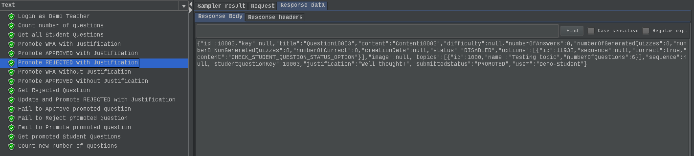

 - [x] [Cypress use case test](https://github.com/tecnico-softeng/es20al_19-project/blob/P4-report/frontend/tests/e2e/specs/teacher/promoteStudentQuestion.js) (Since F4 and F5 were very similar, it was used the same file to test them)
   + Screenshot:

     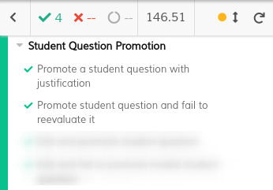

#### F5: _Um docente pode alterar uma pergunta aprovada antes de a colocar como fazendo parte do conjunto de perguntas disponíveis_

 - [x] [Service](https://github.com/tecnico-softeng/es20al_19-project/blob/P4-report/backend/src/main/java/pt/ulisboa/tecnico/socialsoftware/tutor/question/TeacherEvaluatesStudentQuestionService.java#L69) (Reused already defined service. A promotion is still an evaluation)
 - [x] [Spock tests](https://github.com/tecnico-softeng/es20al_19-project/blob/P4-report/backend/src/test/groovy/pt/ulisboa/tecnico/socialsoftware/tutor/studentquestion/service/TeacherPromotesStudentQuestionTest.groovy#L244)
 - [x] [JMeter feature tests](https://github.com/tecnico-softeng/es20al_19-project/blob/develop/backend/jmeter/studentQuestion/WS_F4_PromoteStudentQuestion_Test.jmx) (Since F4 and F5 were very similar, it was used the same file to test them)
   + Screenshots:

     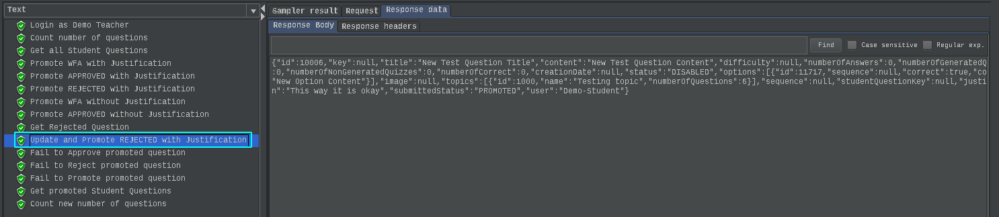

 - [x] [Cypress use case test](https://github.com/tecnico-softeng/es20al_19-project/blob/P4-report/frontend/tests/e2e/specs/teacher/promoteStudentQuestion.js) (Since F4 and F5 were very similar, it was used the same file to test them)
   + Screenshot:

     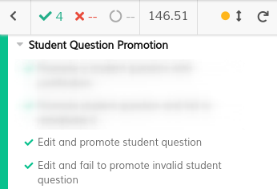

#### F6: _Uma pergunta rejeitada pode ser alterada e resubmetida pelo aluno_

 - [x] [Service](https://github.com)
 - [x] [Spock tests](https://github.com)
 - [x] [JMeter feature test](https://github.com/tecnico-softeng/es20al_19-project/blob/develop/backend/jmeter/studentQuestion/WS_UpdateStudentQuestion.jmx)
    + Screenshots:

    
 - [x] [Cypress use case test](https://github.com/tecnico-softeng/es20al_19-project/blob/P4-report/frontend/tests/e2e/specs/student/studentSubmitStudentQuestion.js)
    + Screenshots:

    

#### F7: _Existe um dashboard do aluno onde é apresentada informação acerca do seu número de perguntas propostas e aprovadas_

**NOTE:** In order for the feature to run, a [sql script](backend/insert_stats.sql) needs to be loaded to add stats to already created users.

- [x] [Service](https://github.com/tecnico-softeng/es20al_19-project/blob/P4-report/backend/src/main/java/pt/ulisboa/tecnico/socialsoftware/tutor/overviewdashboard/MyStatsService.java)
 - [x] [Spock tests - Logged User](https://github.com/tecnico-softeng/es20al_19-project/blob/P4-report/backend/src/test/groovy/pt/ulisboa/tecnico/socialsoftware/tutor/dashboard/service/GetMyStatsServiceSpockTest.groovy)
 - [x] [Spock tests - Other Users](https://github.com/tecnico-softeng/es20al_19-project/blob/P4-report/backend/src/test/groovy/pt/ulisboa/tecnico/socialsoftware/tutor/dashboard/service/GetOtherUserStatsServiceSpockTest.groovy)

 - [x] [JMeter feature test](https://github.com/tecnico-softeng/es20al_19-project/blob/P4-report/backend/jmeter/dashboard/WSgetStudentQuestionDashboardStats.jmx)
    + Screenshots:

    
 - [x] [Cypress use case test](https://github.com/tecnico-softeng/es20al_19-project/blob/P4-report/frontend/tests/e2e/specs/student/dashboard/studentQuestionDashboardStats.js)
    + Screenshots:

    

#### F8: _O aluno decide se esta informação no seu dashboard deve ser pública ou privada_

**NOTE:** In order for the feature to run, a [insert_stats.sql](backend/insert_stats.sql) needs to be loaded to add stats to already created users.

 - [x] [Service](https://github.com/tecnico-softeng/es20al_19-project/blob/P4-report/backend/src/main/java/pt/ulisboa/tecnico/socialsoftware/tutor/overviewdashboard/MyStatsService.java)
 - [x] [Spock tests](https://github.com/tecnico-softeng/es20al_19-project/blob/P4-report/backend/src/test/groovy/pt/ulisboa/tecnico/socialsoftware/tutor/dashboard/service/UpdateMyStatsVisibilitySpockTest.groovy)

 - [x] [JMeter feature test](https://github.com/tecnico-softeng/es20al_19-project/blob/P4-report/backend/jmeter/dashboard/WSupdateStundetQuestionStatsVisibility.jmx)
    + Screenshots:

    
 - [x] [Cypress use case test](https://github.com/tecnico-softeng/es20al_19-project/blob/P4-report/frontend/tests/e2e/specs/student/dashboard/studentQuestionDashboardStats.js)
    + Screenshots:

    

### Additional features

**Notes** The student question evaluation specification changed a little: An Approved question can now be Rejected (F11). Altough it had a name of a feature, it's not considered a new feature. It only needed some verification tweaks and test correction.

---

## Feature DDP

### Subgroup

 - André Breda, ist189409, abread
   + Tasks / Issues Assigned:
      + F4: Service ([#214](https://github.com/tecnico-softeng/es20al_19-project/issues/214)), Spock Tests ([#215](https://github.com/tecnico-softeng/es20al_19-project/issues/215)), Web Service ([#216](https://github.com/tecnico-softeng/es20al_19-project/issues/216)), JMeter Tests ([#217](https://github.com/tecnico-softeng/es20al_19-project/issues/217)), Frontent ()[#218](https://github.com/tecnico-softeng/es20al_19-project/issues/218), Cypress use case Tests ([#219](https://github.com/tecnico-softeng/es20al_19-project/issues/219))
      + Refactoring

 - Mariana Oliveira, ist189504, tpoliveira-mariana
   + Tasks / Issues Assigned:
      + F5: Service ([#220](https://github.com/tecnico-softeng/es20al_19-project/issues/220)), Spock Tests ([#221](https://github.com/tecnico-softeng/es20al_19-project/issues/221)), Web Service ([#222](https://github.com/tecnico-softeng/es20al_19-project/issues/222)), JMeter Tests ([#223](https://github.com/tecnico-softeng/es20al_19-project/issues/223)), Frontend ([#224](https://github.com/tecnico-softeng/es20al_19-project/issues/224)), Cypress use case Tests ([#225](https://github.com/tecnico-softeng/es20al_19-project/issues/225))
      + F6: Service ([#228](https://github.com/tecnico-softeng/es20al_19-project/issues/228)), Spock Tests ([#229](https://github.com/tecnico-softeng/es20al_19-project/issues/229)), Web Service ([#230](https://github.com/tecnico-softeng/es20al_19-project/issues/230)), JMeter Tests ([#231](https://github.com/tecnico-softeng/es20al_19-project/issues/231)), Frontend ([#232](https://github.com/tecnico-softeng/es20al_19-project/issues/232)), Cypress use case Tests ([#233](https://github.com/tecnico-softeng/es20al_19-project/issues/233))
      + F7: Service ([#249](https://github.com/tecnico-softeng/es20al_19-project/issues/249)), Spock Tests ([#250](https://github.com/tecnico-softeng/es20al_19-project/issues/250)), Frontend ([#253](https://github.com/tecnico-softeng/es20al_19-project/issues/253)), Cypress use case Tests ([#254](https://github.com/tecnico-softeng/es20al_19-project/issues/254))
      + F8: Service ([#305](https://github.com/tecnico-softeng/es20al_19-project/issues/305)), Spock Tests ([#306](https://github.com/tecnico-softeng/es20al_19-project/issues/306)), Web Service ([#307](https://github.com/tecnico-softeng/es20al_19-project/issues/307)), JMeter Tests ([#308](https://github.com/tecnico-softeng/es20al_19-project/issues/308)), Frontend ([#309](https://github.com/tecnico-softeng/es20al_19-project/issues/309)), Cypress use case Tests ([#310](https://github.com/tecnico-softeng/es20al_19-project/issues/310))
      + Dashboard Creation:
      [#241](https://github.com/tecnico-softeng/es20al_19-project/issues/241), [#243](https://github.com/tecnico-softeng/es20al_19-project/issues/243),
      [#245](https://github.com/tecnico-softeng/es20al_19-project/issues/245)

    **NOTE:** Issues [#251](https://github.com/tecnico-softeng/es20al_19-project/issues/251) and [#252](https://github.com/tecnico-softeng/es20al_19-project/issues/252) exist, but required nothing to be done.

### Pull requests associated with this feature

The list of pull requests associated with this feature is:

 - F4: [PR #XXX](https://github.com/)
 - F5: [PR #240](https://github.com/tecnico-softeng/es20al_19-project/pull/240)
 - F6: [PR #255](https://github.com/tecnico-softeng/es20al_19-project/pull/255)
 - F7: [PR #284](https://github.com/tecnico-softeng/es20al_19-project/pull/284)
 - F7: [PR #285](https://github.com/tecnico-softeng/es20al_19-project/pull/285)
 - F7: [PR #297](https://github.com/tecnico-softeng/es20al_19-project/pull/297)
 - F7: [PR #318](https://github.com/tecnico-softeng/es20al_19-project/pull/318)
 - F8: [PR #353](https://github.com/tecnico-softeng/es20al_19-project/pull/353)

### Listed features

Below, we list **only** the implemented features. For each feature, we link the relevant files and we mark which are requested parts are completed.

#### Feature number 4: _O aluno pode pedir esclarecimentos adicionais_

 - [x] [Service](https://github.com)
 - [x] [Spock tests](https://github.com)
 - [x] JMeter feature tests: [submit answer](https://github.com), [delete answer](about:blank), [get requests (with answers)](about:blank)
   + Screenshots:

     

 - [x] [Cypress use case test](https://github.com)
   + Screenshot:

     

#### Feature number 5: _O docente pode tornar a questão e o seu esclarecimento disponível para os outros alunos_

 - [x] [Service](https://github.com/tecnico-softeng/es20al_19-project/blob/d07c273d16438621301191d69c21871893b89e21/backend/src/main/java/pt/ulisboa/tecnico/socialsoftware/tutor/clarification/ClarificationService.java#L53)
 - [x] [Spock tests](https://github.com/tecnico-softeng/es20al_19-project/blob/develop/backend/src/test/groovy/pt/ulisboa/tecnico/socialsoftware/tutor/clarification/service/ChangeClarificationRequestStatusServiceSpockTest.groovy)
 - [x] [JMeter feature tests](https://github.com/tecnico-softeng/es20al_19-project/blob/develop/backend/jmeter/clarification/WSchangeClarificationRequestStatusTest.jmx)
   + Screenshots:

     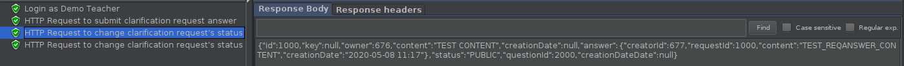
     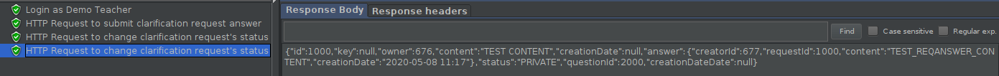

 - [x] [Cypress use case test](https://github.com/tecnico-softeng/es20al_19-project/blob/develop/frontend/tests/e2e/specs/teacher/manageClarificationRequests.js)
   + Screenshot:

     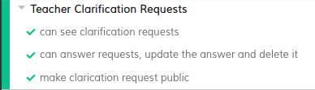

#### Feature number 6: _Um aluno, após responder a uma pergunta, pode consultar, se existirem, os pedidos de esclarecimento sobre essa pergunta e as respostas dadas_

 - [x] [Service](https://github.com/tecnico-softeng/es20al_19-project/blob/d07c273d16438621301191d69c21871893b89e21/backend/src/main/java/pt/ulisboa/tecnico/socialsoftware/tutor/statement/dto/StatementQuestionDto.java#L29)
 - [x] [Spock tests](https://github.com/tecnico-softeng/es20al_19-project/blob/d07c273d16438621301191d69c21871893b89e21/backend/src/test/groovy/pt/ulisboa/tecnico/socialsoftware/tutor/statement/service/GetSolvedQuizzesTest.groovy#L195)
 - [x] [Cypress use case test](https://github.com/tecnico-softeng/es20al_19-project/blob/develop/frontend/tests/e2e/specs/student/manageClarificationRequests.js)
   + Screenshot:

     

#### Feature number 7: _Existe um dashboard do aluno onde é apresentada informação acerca de quantos pedidos de esclarecimento efetuou e quantos deles foram lhe foram creditados_

**NOTE:** In order for the feature to run, a [sql script](backend/insert_stats.sql) needs to be loaded to add stats to already created users.

 - [x] [Service](https://github.com/tecnico-softeng/es20al_19-project/blob/P4-report/backend/src/main/java/pt/ulisboa/tecnico/socialsoftware/tutor/overviewdashboard/MyStatsService.java)
 - [x] [Spock tests](https://github.com)
 - [x] [JMeter feature tests](https://github.com/tecnico-softeng/es20al_19-project/blob/develop/backend/jmeter/dashboard/WSgetClarificationRequestDashboardStats.jmx)
   + Screenshots:

     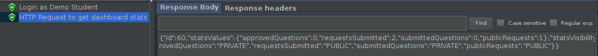

 - [x] [Cypress use case test](https://github.com/tecnico-softeng/es20al_19-project/blob/develop/frontend/tests/e2e/specs/student/dashboard/clarificationRequestsDashboardStats.js)
   + Screenshot:

     

#### Feature number 8: _O aluno decide se esta informação no seu dashboard deve ser pública ou privada_

**NOTE:** In order for the feature to run, a [sql script](backend/insert_stats.sql) needs to be loaded to add stats to already created users.

 - [x] [Service](https://github.com/tecnico-softeng/es20al_19-project/blob/P4-report/backend/src/main/java/pt/ulisboa/tecnico/socialsoftware/tutor/overviewdashboard/MyStatsService.java)
 - [x] [Spock tests](https://github.com)
 - [x] [JMeter feature tests](https://github.com/tecnico-softeng/es20al_19-project/blob/develop/backend/jmeter/dashboard/WSupdateClarificationRequestStatsVisibility.jmx)
   + Screenshots:

     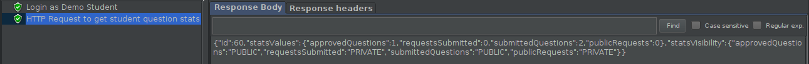

 - [x] [Cypress use case test](https://github.com/tecnico-softeng/es20al_19-project/blob/develop/frontend/tests/e2e/specs/student/dashboard/clarificationRequestsDashboardStats.js)
   + Screenshot:

     

---

## Feature TDP

### Subgroup

 - Lourenço Ramos Duarte, ist197023, LourencoPonces
   + Tasks / Issues Assigned: 
      + F4: Service ([#257](https://github.com/tecnico-softeng/es20al_19-project/issues/257)), Spock Tests ([#258](https://github.com/tecnico-softeng/es20al_19-project/issues/258)), Web Service ([#259](https://github.com/tecnico-softeng/es20al_19-project/issues/259)), JMeter Tests ([#260](https://github.com/tecnico-softeng/es20al_19-project/issues/260)), Frontend ([#261](https://github.com/tecnico-softeng/es20al_19-project/issues/261)), Cypress use case Tests ([#262](https://github.com/tecnico-softeng/es20al_19-project/issues/262))
      + F7: Service ([#278](https://github.com/tecnico-softeng/es20al_19-project/issues/278)), Spock Tests ([#279](https://github.com/tecnico-softeng/es20al_19-project/issues/279)), Web Service ([#280](https://github.com/tecnico-softeng/es20al_19-project/issues/280)), JMeter Tests ([#281](https://github.com/tecnico-softeng/es20al_19-project/issues/281)), Frontend ([#282](https://github.com/tecnico-softeng/es20al_19-project/issues/282)), Cypress use case Tests ([#283](https://github.com/tecnico-softeng/es20al_19-project/issues/283)) 
      + F8: Service ([#347](https://github.com/tecnico-softeng/es20al_19-project/issues/347)), Spock Tests ([#348](https://github.com/tecnico-softeng/es20al_19-project/issues/348)), Web Service ([#349](https://github.com/tecnico-softeng/es20al_19-project/issues/349)), JMeter Tests ([#350](https://github.com/tecnico-softeng/es20al_19-project/issues/350)), Frontend ([#351](https://github.com/tecnico-softeng/es20al_19-project/issues/351)), Cypress use case Tests ([#352](https://github.com/tecnico-softeng/es20al_19-project/issues/352))
      + F9: Service ([#234](https://github.com/tecnico-softeng/es20al_19-project/issues/234)), Spock Tests ([#235](https://github.com/tecnico-softeng/es20al_19-project/issues/235)), Web Service ([#236](https://github.com/tecnico-softeng/es20al_19-project/issues/236)), JMeter Tests ([#237](https://github.com/tecnico-softeng/es20al_19-project/issues/237)), Frontend ([#238](https://github.com/tecnico-softeng/es20al_19-project/issues/238)), Cypress use case Tests ([#239](https://github.com/tecnico-softeng/es20al_19-project/issues/239))
 - Marcelo Santos, ist189496, tosmarcel
   + Tasks / Issues Assigned: 
      + F5: Service ([#263](https://github.com/tecnico-softeng/es20al_19-project/issues/263)), Spock Tests ([#264](https://github.com/tecnico-softeng/es20al_19-project/issues/264))
      + F6: Service ([#312](https://github.com/tecnico-softeng/es20al_19-project/issues/312)), Spock Tests ([#313](https://github.com/tecnico-softeng/es20al_19-project/issues/313)), Web Service ([#314](https://github.com/tecnico-softeng/es20al_19-project/issues/314)), JMeter Tests ([#315](https://github.com/tecnico-softeng/es20al_19-project/issues/315)), Frontend ([#316](https://github.com/tecnico-softeng/es20al_19-project/issues/316)), Cypress use case Tests ([#317](https://github.com/tecnico-softeng/es20al_19-project/issues/317))
      + F11: Service ([#332](https://github.com/tecnico-softeng/es20al_19-project/issues/332)), Spock Tests ([#333](https://github.com/tecnico-softeng/es20al_19-project/issues/333)), Web Service ([#334](https://github.com/tecnico-softeng/es20al_19-project/issues/334)), JMeter Tests ([#335](https://github.com/tecnico-softeng/es20al_19-project/issues/335)), Frontend ([#336](https://github.com/tecnico-softeng/es20al_19-project/issues/336)), Cypress use case Tests ([#337](https://github.com/tecnico-softeng/es20al_19-project/issues/3337))

### Pull requests associated with this feature

The list of pull requests associated with this feature is:

 - [F4: PR #346](https://github.com/tecnico-softeng/es20al_19-project/pull/346)
 - [F5: PR #302](https://github.com/tecnico-softeng/es20al_19-project/pull/302)
 - [F7 & F8: PR #357](https://github.com/tecnico-softeng/es20al_19-project/pull/357)
 - [F9: PR #287](https://github.com/tecnico-softeng/es20al_19-project/pull/287)
 - [Dashboard: PR #265](https://github.com/tecnico-softeng/es20al_19-project/pull/265)

### Listed features

Below, we list **only** the implemented features. For each feature, we link the relevant files and we mark which are requested parts are completed.

#### F4: _O aluno que criou o torneio pode cancelá-lo_

 - [x] [Service](https://github.com/tecnico-softeng/es20al_19-project/blob/45877751feea85e4d8f48d7c89b55f9986a0f262/backend/src/main/java/pt/ulisboa/tecnico/socialsoftware/tutor/tournament/TournamentService.java#L190)
 - [x] [Spock tests](https://github.com/tecnico-softeng/es20al_19-project/blob/develop/backend/src/test/groovy/pt/ulisboa/tecnico/socialsoftware/tutor/tournament/service/CancelTournamentTest.groovy#L36)
 - [x] [JMeter feature tests](https://github.com/tecnico-softeng/es20al_19-project/blob/develop/backend/jmeter/tournament/WSCancelTournamentTest.jmx)
   + Screenshots:

     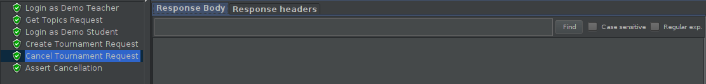

 - [x] [Cypress use case test](https://github.com/tecnico-softeng/es20al_19-project/blob/develop/frontend/tests/e2e/specs/student/tournament/CancelTournament.js)
   + Screenshot:

     

#### F5: _Se o número de alunos inscritos, incluindo o criador do torneio, for superior a 1, o sistema gera o quiz associado ao torneio_

 - [x] [Service](https://github.com)
 - [x] [Spock tests](https://github.com)
 - [x] [JMeter feature tests](https://github.com)
   + Screenshots:

     

 - [x] [Cypress use case test](https://github.com)
   + Screenshot:

     

#### F6: _Os alunos participantes respodem às perguntas no período definido para o torneio_

 - [x] [Service](https://github.com)
 - [x] [Spock tests](https://github.com)
 - [x] [JMeter feature tests](https://github.com)
   + Screenshots:

     

 - [x] [Cypress use case test](https://github.com)
   + Screenshot:

     

#### F7: _Existe um dashboard do aluno onde é apresentada informação acerca dos torneios em que participou e qual a sua pontuação_ & F8: _O aluno decide se esta informação no seu dashboard deve ser pública ou privada_

**NOTE:** In order for the feature to run, a [sql script](backend/insert_stats.sql) needs to be loaded to add stats to already created users.

 - [x] [Service](https://github.com/tecnico-softeng/es20al_19-project/blob/develop/backend/src/main/java/pt/ulisboa/tecnico/socialsoftware/tutor/overviewdashboard/MyStatsService.java)
 - [x] [Spock tests](https://github.com/tecnico-softeng/es20al_19-project/blob/develop/backend/src/test/groovy/pt/ulisboa/tecnico/socialsoftware/tutor/dashboard/service/GetMyStatsServiceSpockTest.groovy)
 - [x] [Cypress use case test](https://github.com/tecnico-softeng/es20al_19-project/blob/develop/frontend/tests/e2e/specs/student/dashboard/tournamentsDashboardStats.js)
   + Screenshot:

     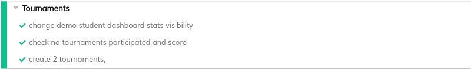

### Additional features

**TODO**: if you have implemented additional features, describe them here (following the same format as above).

#### F9: _Os alunos podem aceder aos seus torneios criados_

 - [x] [Service](https://github.com/tecnico-softeng/es20al_19-project/blob/45877751feea85e4d8f48d7c89b55f9986a0f262/backend/src/main/java/pt/ulisboa/tecnico/socialsoftware/tutor/tournament/TournamentService.java#L190)
 - [x] [Spock tests](https://github.com/tecnico-softeng/es20al_19-project/blob/develop/backend/src/test/groovy/pt/ulisboa/tecnico/socialsoftware/tutor/tournament/service/GetCreatedTournamentsTest.groovy)
 - [x] [JMeter feature tests](https://github.com/tecnico-softeng/es20al_19-project/blob/develop/backend/jmeter/tournament/WSGetCreatedTournamentTest.jmx)
   + Screenshots:

     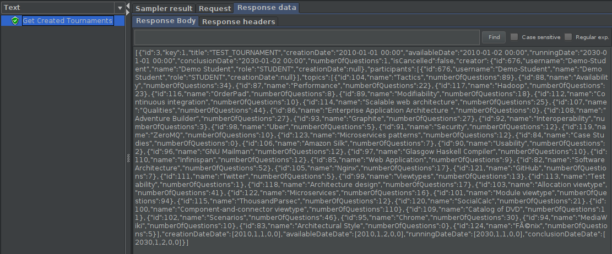

 - [x] [Cypress use case test](https://github.com/tecnico-softeng/es20al_19-project/blob/develop/frontend/tests/e2e/specs/student/tournament/getCreatedTournaments.js)
   + Screenshot:

     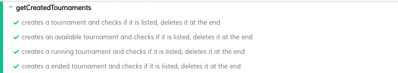

---
