# ES20 final submission, Group 19

## Feature UI

### Mobile Responsiveness

#### Subgroup
Afonso Gonçalves & Mariana Oliveira

#### Description
Refactor the application presentation, so it is more usable in smaller screens. We managed to have no information loss in this refactor.

#### Screenshots

**Teacher Questions**

Desktop                              |  Mobile
:-----------------------------------:|:-----------------------------------:
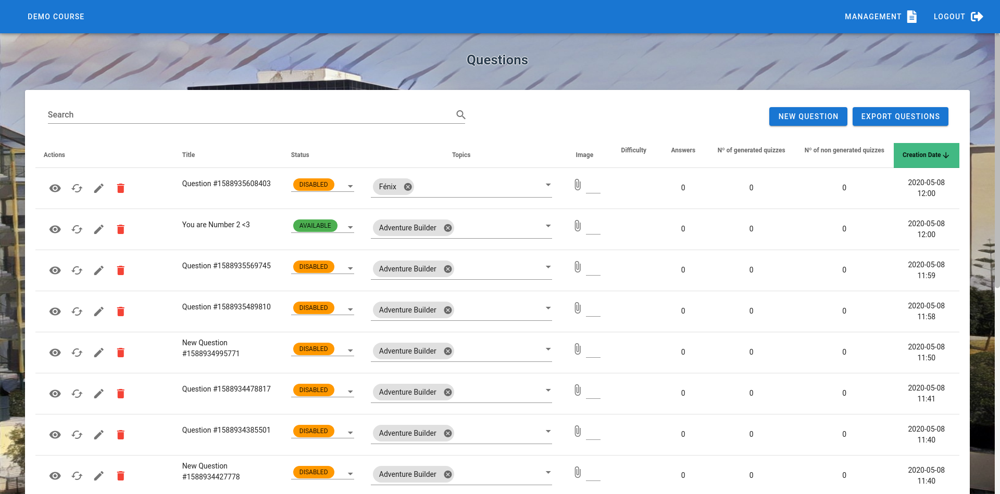 | 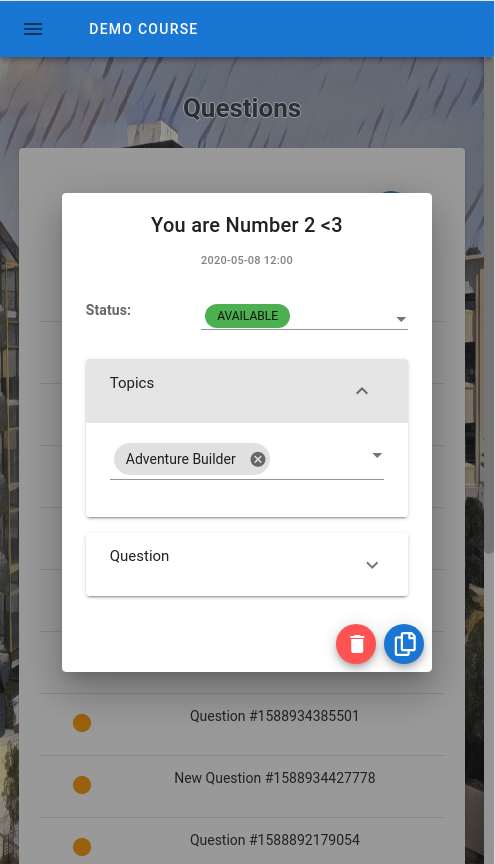

**Teacher Quizzes**

Desktop                              |  Mobile
:-----------------------------------:|:-----------------------------------:
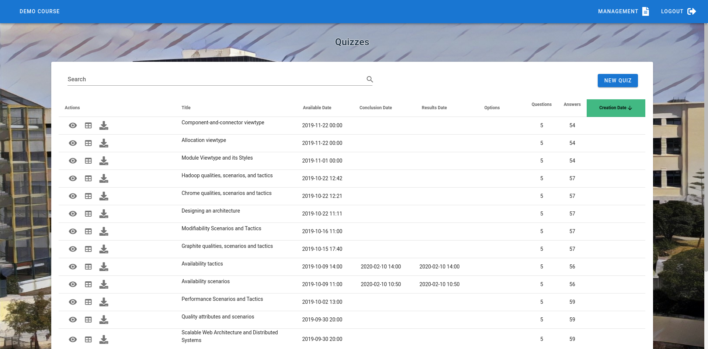 | 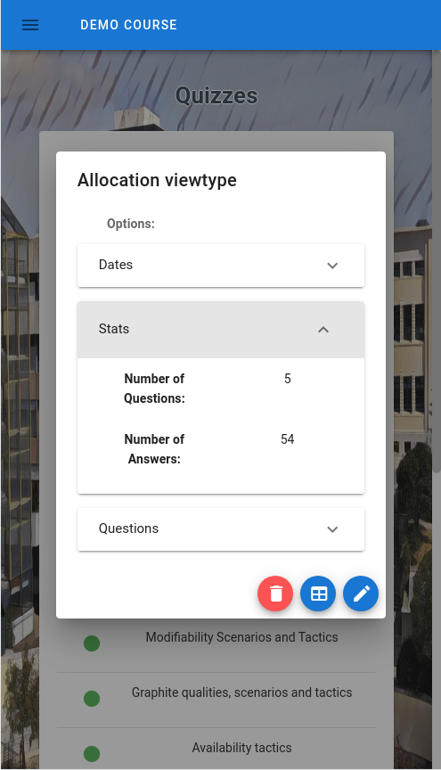

**Teacher Assessments**

Desktop                              |  Mobile
:-----------------------------------:|:-----------------------------------:
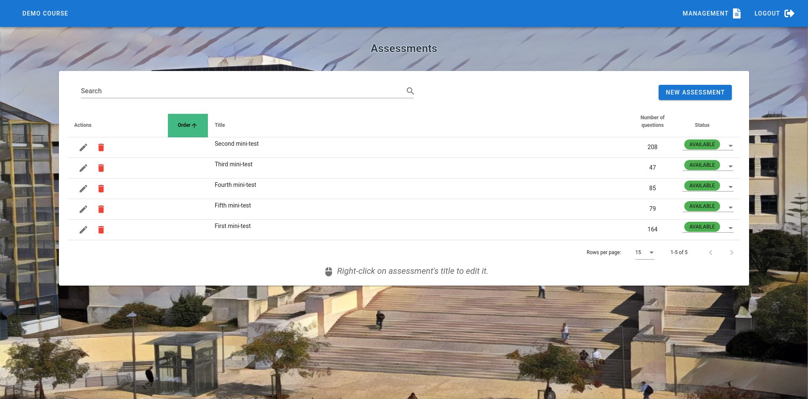 | 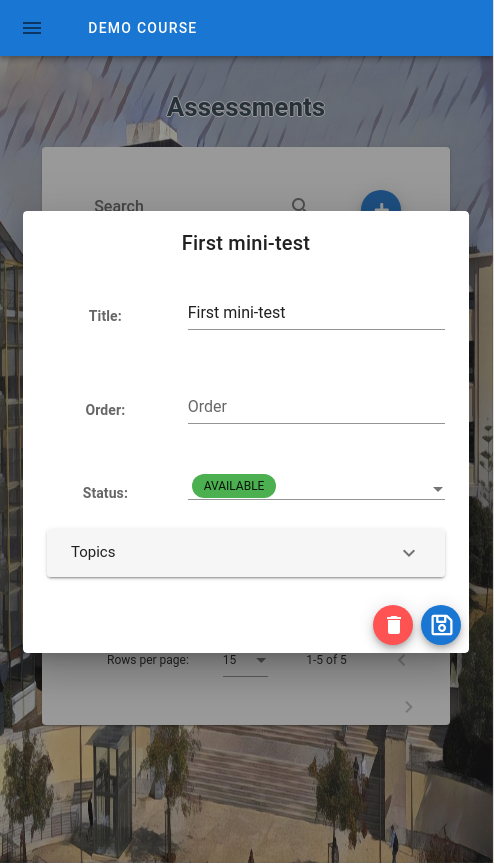

**Teacher Students**

Desktop                              |  Mobile
:-----------------------------------:|:-----------------------------------:
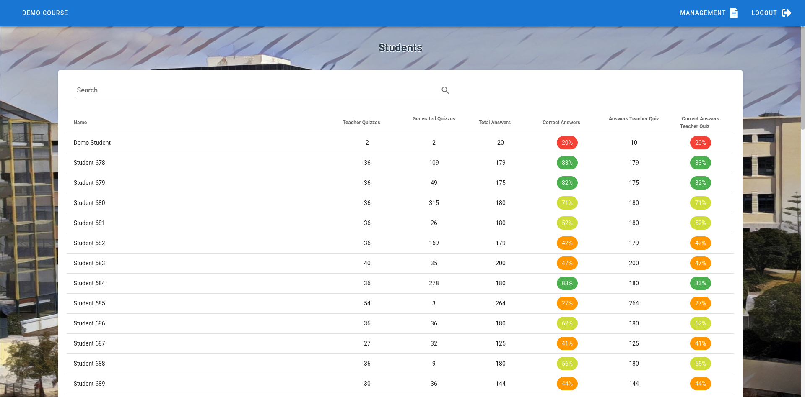 | 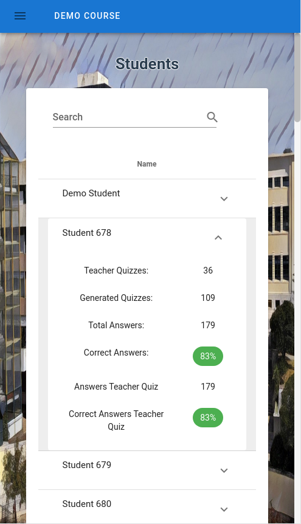

**Teacher Topics**

Desktop                              |  Mobile
:-----------------------------------:|:-----------------------------------:
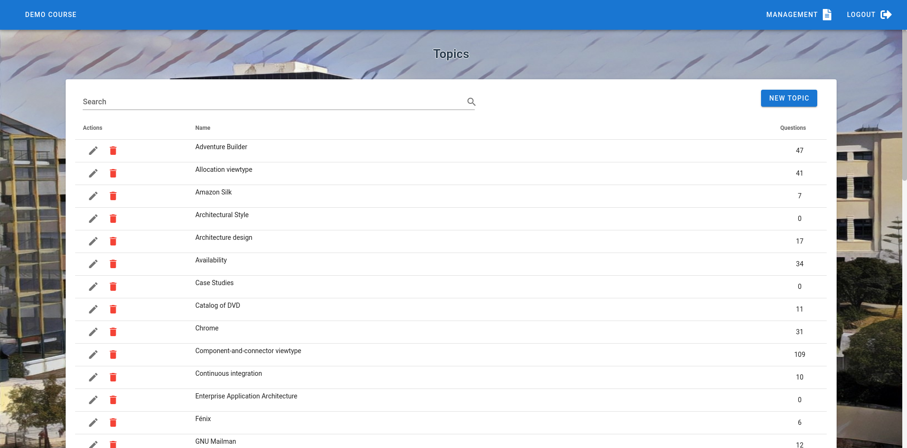 | 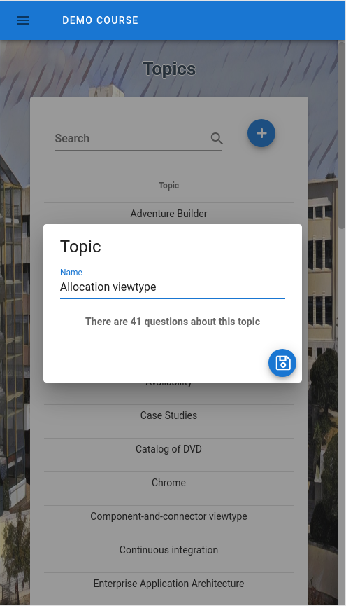

**Student Student Questions**

Desktop                              |  Mobile
:-----------------------------------:|:-----------------------------------:
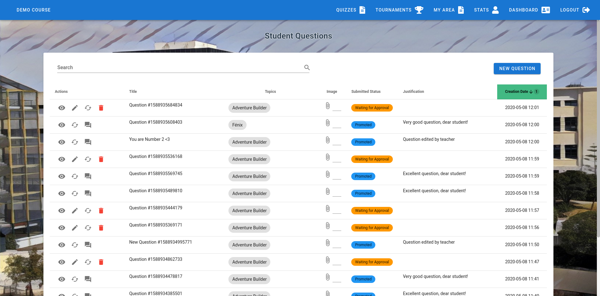 | 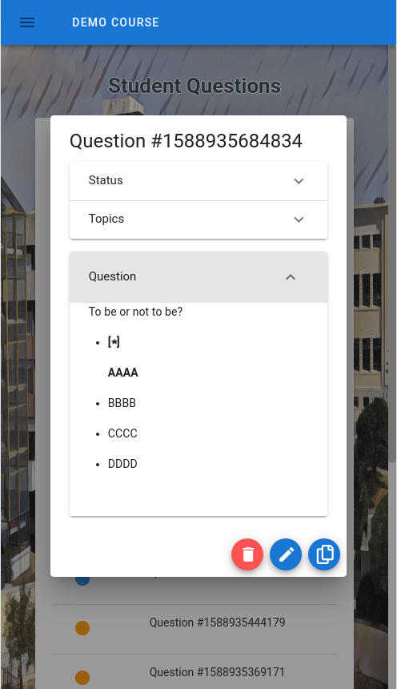

**Student Created Tournaments**

Desktop                              |  Mobile
:-----------------------------------:|:-----------------------------------:
 | 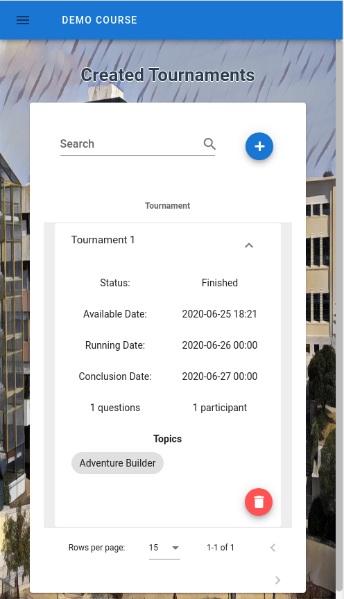

**Student Available Tournaments**

Desktop                              |  Mobile
:-----------------------------------:|:-----------------------------------:
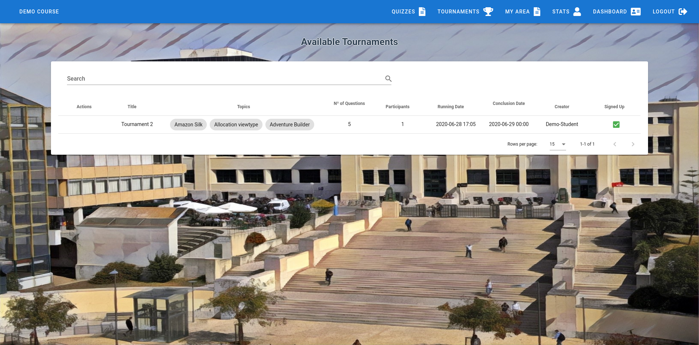 | 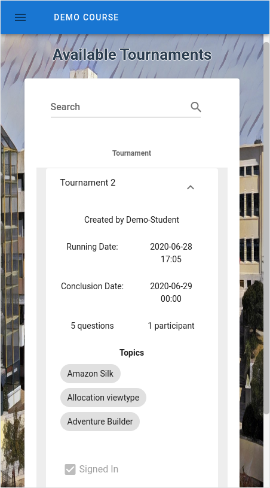

**Student Running Tournaments**

Desktop                              |  Mobile
:-----------------------------------:|:-----------------------------------:
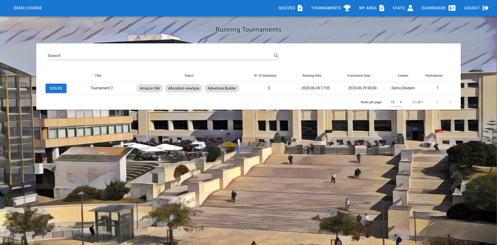 | 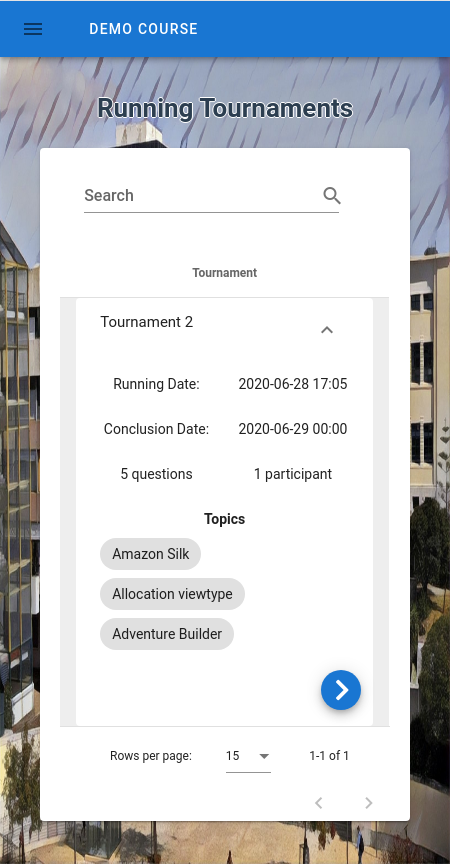

### Mathematical writing

#### Subgroup
Daniel Seara

#### Description
Allow teachers and students to create questions and insert mathematical formulas, using CKEditor4 and Latex

#### Screenshots

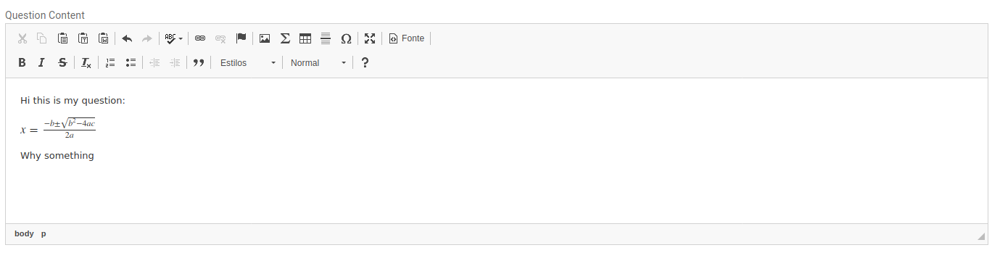  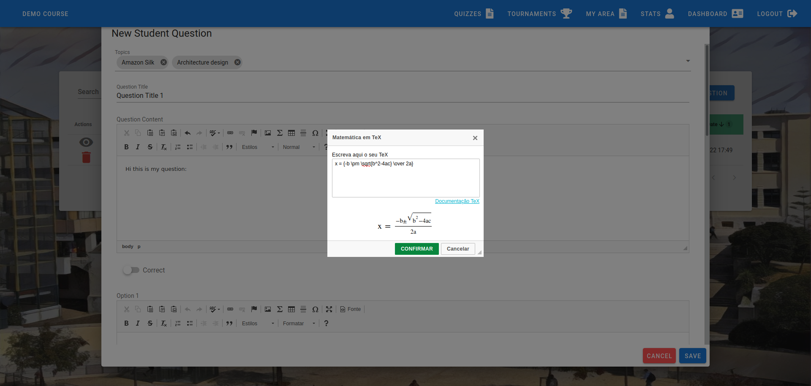

### Interface Consistency

#### Subgroup
Daniel Seara

#### Description
Normalize the size of all the action buttons and the color of the Save/Cancel buttons.

#### Screenshots

**Cancel/Save buttons**

Before                               |  After
:-----------------------------------:|:-----------------------------------:
 | 

**Action buttons**

Before                               |  After
:-----------------------------------:|:-----------------------------------:
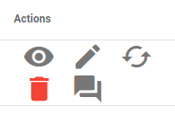 | 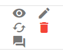

## Conclusion of Tournament Feature

### Solved Tournaments

#### Subgroup
Lourenço Duarte & Marcelo Santos

#### Description
Allow students to see the tournaments that they have participated

#### Screenshots
